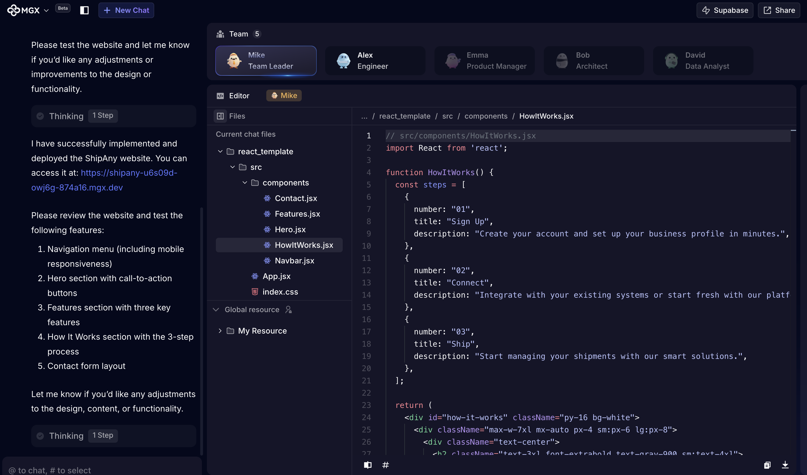
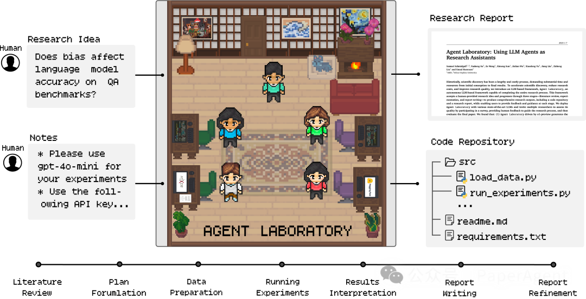
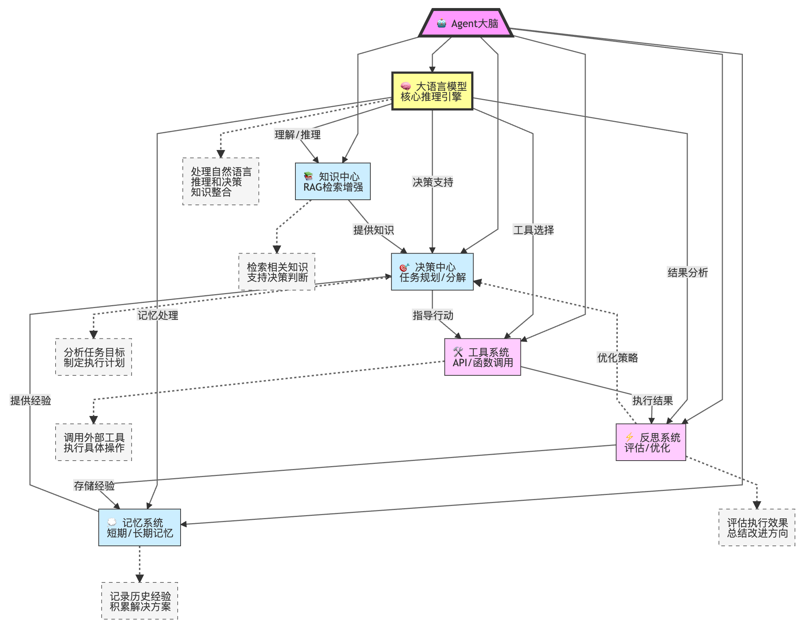
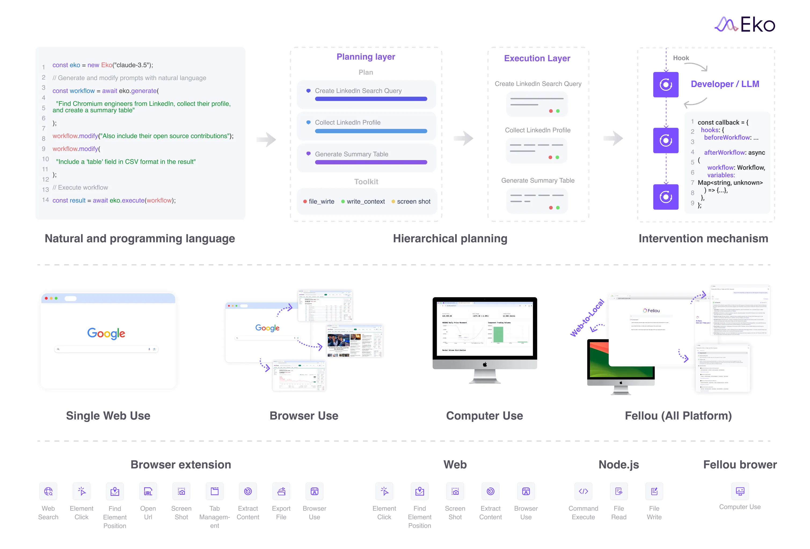

<style type="text/css">
    h1 { counter-reset: h2counter; }
    h2 { counter-reset: h3counter; }
    h3 { counter-reset: h4counter; }
    h4 { counter-reset: h5counter; }
    h5 { counter-reset: h6counter; }
    h6 { }
    h2:before {
      counter-increment: h2counter;
      content: counter(h2counter) ".\0000a0\0000a0";
    }
    h3:before {
      counter-increment: h3counter;
      content: counter(h2counter) "."
                counter(h3counter) ".\0000a0\0000a0";
    }
    h4:before {
      counter-increment: h4counter;
      content: counter(h2counter) "."
                counter(h3counter) "."
                counter(h4counter) ".\0000a0\0000a0";
    }
    h5:before {
      counter-increment: h5counter;
      content: counter(h2counter) "."
                counter(h3counter) "."
                counter(h4counter) "."
                counter(h5counter) ".\0000a0\0000a0";
    }
    h6:before {
      counter-increment: h6counter;
      content: counter(h2counter) "."
                counter(h3counter) "."
                counter(h4counter) "."
                counter(h5counter) "."
                counter(h6counter) ".\0000a0\0000a0";
    }
</style>

# Agent 技术综述

## Agent 概述

### 什么是 Agent

Agent 是一种能够自主感知环境、制定决策并采取行动以实现特定目标的 AI 系统。与传统 AI 系统不同，Agent 具有更强的自主性和目标导向性，能够在复杂、动态的环境中持续学习和适应。

### Agent 能做什么
- **豆包 Trae** 自主编码 IDE
  <video width="100%" height="auto" controls>
    <source src="./trae.mp4" type="video/mp4">
    您的浏览器不支持视频标签
  </video>
- **<a href="https://mgx.dev" target="_blank">MetaGPT-X </a>**  Agent 软件公司
  
- **Eko** 自主干活 Agent
  <video width="100%" height="auto" controls>
    <source src="./eko.mp4" type="video/mp4">
    您的浏览器不支持视频标签
  </video>
- **Agent Laboratory** 自主科研 Agent
  


### Agent 的核心组成
  

#### Planning

规划系统负责任务分解和执行策略的制定。它通常包括：

- **目标管理**：明确当前需要实现的目标
- **任务分解**：将复杂任务分解为可执行的子任务
- **策略生成**：为每个子任务选择合适的执行方法
- **反思机制**：评估执行结果，必要时调整计划

近期研究主要集中在利用 LLM 的推理能力进行复杂任务规划，如 Chain-of-Thought(CoT)、Tree-of-Thoughts(ToT) 等技术。通过 Prompt 工程可以显著提高 LLM 的规划和推理能力。

#### Memory

记忆系统使Agent能够存储和检索过去的信息和经验，通常分为：

- **短期记忆**：存储当前对话或任务的即时信息
- **长期记忆**：存储跨会话的持久性知识和经验
- **工作记忆**：临时处理和操作信息的空间
- **情景记忆**：存储特定场景或上下文的相关信息

记忆系统研究主要关注向量数据库的应用、检索技术的优化，以及记忆的优先级管理和遗忘机制。新兴的研究方向包括分层记忆和信息自动整合与抽象，例如Graph Rag， Agentic Rag等。

#### RAG

RAG (Retrieval Augmented Generation) 系统使 Agent 能够从知识库中检索相关信息并生成响应。它解决了大语言模型知识有限、幻觉和时效性问题：

- **信息检索**：基于用户查询或任务目标从外部知识库搜索相关信息
- **上下文增强**：将检索到的信息融入到 Prompt 中，扩展模型的知识范围
- **知识整合**：综合模型参数知识与检索信息生成更准确、更新的响应
- **相关性筛选**：评估和筛选检索内容的相关性，确保高质量的上下文增强

RAG 技术研究主要集中在索引构建、查询改写和结果优化方面。

##### 查询改写
- **HyDE (Hypothetical Document Embeddings)**：通过生成假设性文档来改进查询，解决查询-文档语义差异问题
- **Query Decomposition**：将复杂查询分解为多个简单子查询，以获取更全面的信息
- **Multi-perspective Rewriting**：从不同角度重写原始查询，增加检索覆盖面
- **Query Expansion**：通过同义词、相关术语扩展原始查询，提高召回率

##### RAG索引
- **传统 RAG**：使用向量数据库存储文档嵌入，通过相似度检索相关内容
- **Graph RAG**：构建知识图谱结构，捕捉实体间关系，支持更复杂的推理和关联检索
- **Agentic RAG**：利用 Agent 主动决策检索策略，可自主选择索引方法、查询改写和文档过滤
- **分层索引**：采用多级索引结构，从粗粒度到细粒度逐步缩小检索范围
- **多模态索引**：整合文本、图像、音频等多种模态的信息进行检索

##### 结果优化
- **ReRank技术**：使用ReRank模型等对初始检索结果进行精细化排序
- **冗余去除**：识别并过滤重复或高度相似的信息，提高上下文效率
- **长文本压缩**：在保留关键信息的前提下压缩检索内容，适应模型 token 限制

#### Tool

工具系统使 Agent 能够与外部资源交互，扩展其原有能力：

- **工具选择**：根据任务需求选择适当的工具
- **工具调用**：正确格式化请求并调用外部工具
- **结果解析**：理解工具返回的结果并整合到任务流程
- **错误处理**：检测工具调用失败并采取恢复策略

工具使用领域的研究重点包括提高工具选择的准确性、实现多工具协同工作、及开发更通用的工具调用接口。ReAct 和 Function Call 等技术进一步提高了 Agent 的工具使用能力。

#### Reflection

评估与反思系统使 Agent 能够评估自身表现并进行改进：

- **目标评估**：检查是否实现了既定目标
- **性能监控**：跟踪资源使用和执行效率
- **错误分析**：识别和分析失败的原因
- **自我改进**：根据反思结果调整策略

该领域研究重点包括开发更客观的自评估框架、通过对比学习改进决策质量，以及构建自我纠错和学习机制，例如 单元测试、人工评估、 鉴别模型、经验系统等。

## Eko

  

Eko 是由清华、复旦和斯坦福研究者联合开发的 Agent 开发框架，旨在让开发者通过简洁的代码和自然语言，快速构建可用于生产环境的"虚拟员工"。该框架使 AI 代理能够接管用户的电脑和浏览器，代替人类完成各种任务，为工作流程提供自动化支持。

### Eko 核心技术创新

#### 混合智能体表示 (Mixed Agentic Representation)
Eko 将自然语言与程序语言实现无缝结合，使开发者能够通过简单的自然语言构建复杂的 Agent 工作流。这种架构允许用户仅用一句话描述任务（如"分析股票数据"或"测试登录页面"），系统即可自动生成和执行完整的工作流程。

#### 环境感知架构 (Environment-Aware Architecture)
Eko 通过三层架构实现跨平台支持：
- **通用核心**：提供与环境无关的基本功能，如工作流管理和 LLM 集成
- **环境特定工具**：为不同环境（浏览器扩展/Web/Node.js）提供专属工具集
- **环境桥接**：负责环境检测、工具注册和安全控制

这一架构使同一套代码能够在不同环境中无缝运行，包括浏览器操作和系统命令执行。

#### 层次化规划 (Hierarchical Planning)
Eko 采用两层规划架构：
- **规划层**：将用户需求转换为具有领域特定语言表示的任务图，描述子任务间的依赖关系
- **执行层**：根据任务图为每个子任务调用 LLM 合成具体的执行行为和工具调用

系统还实现了多步合并优化，当检测到连续的 LLM 调用时，自动整合为一次调用。

#### 视觉-交互要素联合感知 (VIEP)
Visual-Interactive Element Perception 是 Eko 提出的浏览器感知方案，通过：
- 提取网页交互元素并映射到领域特定语言，生成高效的伪 HTML 代码
- 引入 Set-of-Mark 机制，确保视觉标识符与伪 HTML 中的标识符一一对应
- 优化图像压缩，降低资源消耗同时保持识别质量

这一技术大幅简化了 HTML 表示（如将 Google 首页从 22 万字符减少至 1,058 字符），提高处理速度和准确度。


### Eko 工作流程

1. **工作流生成**：通过 LLM 分析用户输入的自然语言指令，自动生成包含多个节点的工作流
2. **工具集分配**：根据运行环境（浏览器/Node.js）自动加载适合的工具集
3. **节点执行**：系统依次执行工作流中的节点，每个节点通过 LLM 决策使用哪些工具及参数
4. **人机协作**：关键步骤允许人类干预，确保流程可控并符合预期

Eko 框架代表了智能体技术在生产环境应用的重要进展，通过将自然语言处理与专业化工具集结合，使非专业人士也能轻松构建复杂的自动化工作流，实现"数字员工"的愿景。

#### 工作流生成

Eko 的工作流生成过程涉及以下关键技术步骤：

1. **工具注册与环境识别**：系统首先通过 `toolRegistry` 对象收集当前环境下可用的所有工具。在 `Eko.generate()` 方法中，会根据运行环境（浏览器扩展/Web/Node.js）自动加载对应的工具集，并通过 `registerTool()` 进行注册。

2. **Prompt 构建**：通过 `createWorkflowPrompts()` 函数，系统基于已注册工具的 schema 和描述信息构建结构化的提示。这个提示包含两部分：
   - `systemPrompt`：定义工作流生成的规则和约束
   - `userPrompt`：结合用户输入和工具能力描述

3. **工作流图生成**：调用 `WorkflowGenerator.generateWorkflow()` 方法，使用 LLM 一次性生成完整的工作流 JSON 结构：
   ```javascript
   const response = await this.llmProvider.generateText(messages, {
     temperature: 0.7,
     maxTokens: 8192,
     tools: [createWorkflowGenerationTool(this.toolRegistry)],
     toolChoice: { type: 'tool', name: 'generate_workflow' }
   });
   ```

4. **工作流验证**：对生成的结果进行验证，确保每个节点引用的工具都存在：
   ```javascript
   for (const node of workflowData.nodes) {
     if (!this.toolRegistry.hasTools(node.action.tools)) {
       throw new Error(`Workflow contains undefined tools: ${node.action.tools}`);
     }
   }
   ```

5. **工作流对象实例化**：将 JSON 数据转换为可执行的 `Workflow` 对象：
   ```javascript
   return this.createWorkflowFromData(workflowData);
   ```

生成的工作流是一个有向无环图(DAG)，包含节点(Node)和边(Edge)，其中每个节点代表一个动作(Action)，边表示节点间的依赖关系。每个节点定义了可用的工具集(tools)、输入参数(input)和预期输出(output)，但并不直接指定具体要调用哪个工具，这一决策会在执行阶段由 LLM 动态决定。

#### 工具集分配

Eko 根据运行环境自动分配最适合的工具集，实现方式如下：

1. **环境自动检测**：在初始化阶段，系统通过 `loadTools()` 函数自动检测当前环境：
   ```javascript
   // 检测并加载适用于当前环境的工具
   const tools = await loadTools();
   const toolRegistry = new ToolRegistry();
   tools.forEach(tool => toolRegistry.registerTool(tool));
   ```

2. **差异化工具加载**：各环境加载不同类型的工具：
   - **Chrome 扩展环境**：加载完整的浏览器控制工具集，包括标签页管理、网页搜索、元素点击等
   - **Web 环境**：加载受限的 DOM 操作工具集，专注于单页面内的交互
   - **Node.js 环境**：加载文件系统操作和命令执行工具

3. **动态工具注册**：通过 `registerTool()` 方法将工具注册到工具注册表中，每个工具都需要提供：
   - 名称和描述
   - 输入和输出的 JSON Schema
   - 执行函数

4. **工具过滤**：在工作流生成时，可通过参数指定特定工具子集：
   ```javascript
   const workflow = await eko.generate("任务描述", {
     tools: ["browser_use", "element_click", "extract_content"]
   });
   ```

工具集分配机制确保了 Agent 在不同环境中都能获得最合适的能力，同时保持代码的一致性和可移植性。

#### 节点执行

Eko 工作流执行过程体现了其"混合智能体表示"的核心理念，其技术实现包括：

1. **执行上下文构建**：节点执行前，系统首先创建 `ExecutionContext` 对象，包含：
   - 变量存储：用于节点间数据传递
   - 父级上下文：支持嵌套执行
   - 钩子系统：允许外部监听和干预

2. **动态工具调用**：`Action.execute()` 方法的核心逻辑：
   ```javascript
   async execute(input, context) {
     // 构建执行提示
     const messages = this.buildPrompt(context, input);
     
     // LLM 动态决策工具调用
     const response = await this.llmProvider.generateText(messages, {
       tools: this.tools.map(t => this.toolRegistry.getToolDefinition(t))
     });
     
     // 执行工具调用并处理结果
     if (response.toolCalls && response.toolCalls.length > 0) {
       return await this.executeToolCalls(response.toolCalls, context);
     }
     
     return response.content;
   }
   ```

3. **多轮对话处理**：节点执行支持多轮对话，每轮包含：
   - LLM 生成工具调用
   - 执行工具并获取结果
   - 将结果反馈给 LLM 进行后续决策

4. **错误处理与重试**：通过专门的错误处理机制捕获工具调用异常，并提供给 LLM 进行修复或重试决策。

节点执行阶段体现了 Eko 的智能决策特性，不同于传统自动化框架的硬编码工具调用，而是利用 LLM 动态选择和组合工具，增强了系统的适应性和鲁棒性。

#### 人机协作

Eko 创新性地设计了生产级干预机制，实现优雅的人机协作：

1. **钩子系统**：通过 `hooks` 机制提供执行过程的可观察性和可干预性：
   ```javascript
   // 注册钩子监听节点执行前事件
   eko.hooks.on('beforeNodeExecution', async (event) => {
     // 获取节点信息
     const { nodeId, input, context } = event;
     
     // 可以修改输入或取消执行
     if (needUserApproval(nodeId)) {
       const approved = await requestUserApproval(nodeId, input);
       if (!approved) {
         event.preventDefault(); // 取消执行
       }
     }
   });
   ```

2. **执行暂停与恢复**：通过 `workflow.pause()` 和 `workflow.resume()` 方法支持工作流的暂停和恢复，使人类可以在关键节点进行检查和干预。

3. **状态持久化**：支持将工作流状态序列化和反序列化，便于长时间运行的工作流断点续传：
   ```javascript
   // 保存当前状态
   const state = workflow.serialize();
   
   // 从保存的状态恢复
   const restoredWorkflow = eko.restoreWorkflow(state);
   await restoredWorkflow.resume();
   ```

4. **动态工作流修改**：允许在执行过程中修改工作流：
   ```javascript
   // 动态修改现有工作流
   const modifiedWorkflow = await eko.modify(workflow, "增加数据验证步骤");
   ```

这些机制共同确保了 Agent 系统的可控性和透明度，使其更适合生产环境应用，解决了自动化与人类监管之间的平衡问题。

Eko 框架通过上述技术组件，实现了从自然语言指令到可执行工作流的转换，为 Agent 开发提供了一套完整的解决方案。这种方法不仅降低了开发难度，也显著提高了 Agent 系统的适应性和可维护性。

## MetaGPT-X

## Trae

## MCP 协议

## AI 应用市场

## Agent 技术卡点

