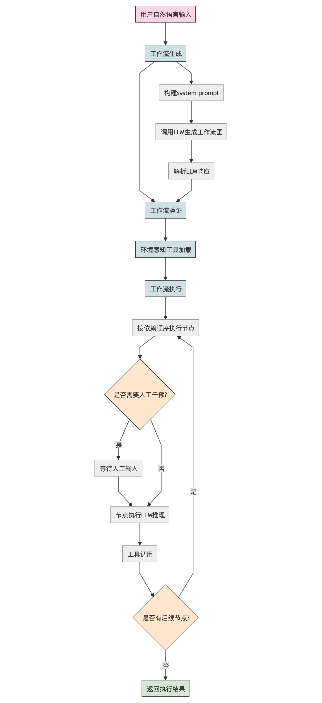
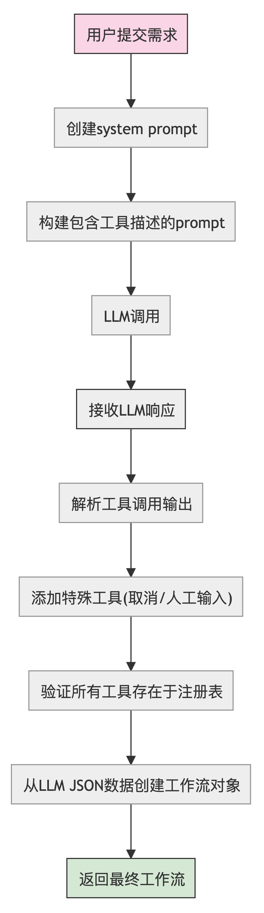

<style type="text/css">
    h1 { counter-reset: h2counter; }
    h2 { counter-reset: h3counter; }
    h3 { counter-reset: h4counter; }
    h4 { counter-reset: h5counter; }
    h5 { counter-reset: h6counter; }
    h6 { }
    h2:before {
      counter-increment: h2counter;
      content: counter(h2counter) ".\0000a0\0000a0";
    }
    h3:before {
      counter-increment: h3counter;
      content: counter(h2counter) "."
                counter(h3counter) ".\0000a0\0000a0";
    }
    h4:before {
      counter-increment: h4counter;
      content: counter(h2counter) "."
                counter(h3counter) "."
                counter(h4counter) ".\0000a0\0000a0";
    }
    h5:before {
      counter-increment: h5counter;
      content: counter(h2counter) "."
                counter(h3counter) "."
                counter(h4counter) "."
                counter(h5counter) ".\0000a0\0000a0";
    }
    h6:before {
      counter-increment: h6counter;
      content: counter(h2counter) "."
                counter(h3counter) "."
                counter(h4counter) "."
                counter(h5counter) "."
                counter(h6counter) ".\0000a0\0000a0";
    }
</style>

# Agent 技术综述

## Agent 概述

### 什么是 Agent

Agent 是一种能够自主感知环境、制定决策并采取行动以实现特定目标的 AI 系统。与传统 AI 系统不同，Agent 具有更强的自主性和目标导向性，能够在复杂、动态的环境中持续学习和适应。

### Agent 能做什么
- **豆包 Trae** 自主编码 IDE
  <video width="100%" height="auto" controls>
    <source src="./trae.mp4" type="video/mp4">
    您的浏览器不支持视频标签
  </video>
- **<a href="https://mgx.dev" target="_blank">MetaGPT-X </a>**  Agent 软件公司
  
- **Eko** 自主干活 Agent
  <video width="100%" height="auto" controls>
    <source src="./eko.mp4" type="video/mp4">
    您的浏览器不支持视频标签
  </video>
- **Agent Laboratory** 自主科研 Agent
  


### Agent 的核心组成
  

#### Planning

规划系统负责任务分解和执行策略的制定。它通常包括：

- **目标管理**：明确当前需要实现的目标
- **任务分解**：将复杂任务分解为可执行的子任务
- **策略生成**：为每个子任务选择合适的执行方法
- **反思机制**：评估执行结果，必要时调整计划

近期研究主要集中在利用 LLM 的推理能力进行复杂任务规划，如 Chain-of-Thought(CoT)、Tree-of-Thoughts(ToT) 等技术。通过 Prompt 工程可以显著提高 LLM 的规划和推理能力。

#### Memory

记忆系统使Agent能够存储和检索过去的信息和经验，通常分为：

- **短期记忆**：存储当前对话或任务的即时信息
- **长期记忆**：存储跨会话的持久性知识和经验
- **工作记忆**：临时处理和操作信息的空间
- **情景记忆**：存储特定场景或上下文的相关信息

记忆系统研究主要关注向量数据库的应用、检索技术的优化，以及记忆的优先级管理和遗忘机制。新兴的研究方向包括分层记忆和信息自动整合与抽象，例如Graph Rag， Agentic Rag等。

#### RAG

RAG (Retrieval Augmented Generation) 系统使 Agent 能够从知识库中检索相关信息并生成响应。它解决了大语言模型知识有限、幻觉和时效性问题：

- **信息检索**：基于用户查询或任务目标从外部知识库搜索相关信息
- **上下文增强**：将检索到的信息融入到 Prompt 中，扩展模型的知识范围
- **知识整合**：综合模型参数知识与检索信息生成更准确、更新的响应
- **相关性筛选**：评估和筛选检索内容的相关性，确保高质量的上下文增强

RAG 技术研究主要集中在索引构建、查询改写和结果优化方面。

##### 查询改写
- **HyDE (Hypothetical Document Embeddings)**：通过生成假设性文档来改进查询，解决查询-文档语义差异问题
- **Query Decomposition**：将复杂查询分解为多个简单子查询，以获取更全面的信息
- **Multi-perspective Rewriting**：从不同角度重写原始查询，增加检索覆盖面
- **Query Expansion**：通过同义词、相关术语扩展原始查询，提高召回率

##### RAG索引
- **传统 RAG**：使用向量数据库存储文档嵌入，通过相似度检索相关内容
- **Graph RAG**：构建知识图谱结构，捕捉实体间关系，支持更复杂的推理和关联检索
- **Agentic RAG**：利用 Agent 主动决策检索策略，可自主选择索引方法、查询改写和文档过滤
- **分层索引**：采用多级索引结构，从粗粒度到细粒度逐步缩小检索范围
- **多模态索引**：整合文本、图像、音频等多种模态的信息进行检索

##### 结果优化
- **ReRank技术**：使用ReRank模型等对初始检索结果进行精细化排序
- **冗余去除**：识别并过滤重复或高度相似的信息，提高上下文效率
- **长文本压缩**：在保留关键信息的前提下压缩检索内容，适应模型 token 限制

#### Tool

工具系统使 Agent 能够与外部资源交互，扩展其原有能力：

- **工具选择**：根据任务需求选择适当的工具
- **工具调用**：正确格式化请求并调用外部工具
- **结果解析**：理解工具返回的结果并整合到任务流程
- **错误处理**：检测工具调用失败并采取恢复策略

工具使用领域的研究重点包括提高工具选择的准确性、实现多工具协同工作、及开发更通用的工具调用接口。ReAct 和 Function Call 等技术进一步提高了 Agent 的工具使用能力。

#### Reflection

评估与反思系统使 Agent 能够评估自身表现并进行改进：

- **目标评估**：检查是否实现了既定目标
- **性能监控**：跟踪资源使用和执行效率
- **错误分析**：识别和分析失败的原因
- **自我改进**：根据反思结果调整策略

该领域研究重点包括开发更客观的自评估框架、通过对比学习改进决策质量，以及构建自我纠错和学习机制，例如 单元测试、人工评估、 鉴别模型、经验系统等。

## Eko

  

Eko 是由清华、复旦和斯坦福研究者联合开发的 Agent 开发框架，旨在让开发者通过简洁的代码和自然语言，快速构建可用于生产环境的"虚拟员工"。该框架使 AI 代理能够接管用户的电脑和浏览器，代替人类完成各种任务。

### Eko 核心技术创新

#### 混合智能体表示
Eko 将自然语言与程序语言实现无缝结合，使开发者能够通过自然语言构建复杂的 Agent 工作流。这种架构允许用户仅用一句话描述任务（如"分析股票数据"或"测试登录页面"），系统即可自动生成和执行完整的工作流程。

#### 环境感知架构
Eko 通过三层架构实现跨平台支持：
- **通用核心**：提供与环境无关的基本功能，如工作流管理和 LLM 集成
- **环境特定工具**：为不同环境（浏览器扩展/Web/Node.js）提供专属工具集
- **环境桥接**：负责环境检测、工具注册和安全控制


#### 层次化规划
Eko 采用两层规划架构：
- **规划层**：将用户需求转换为具有领域特定语言表示的任务图，描述子任务间的依赖关系
- **执行层**：根据任务图为每个子任务调用 LLM 生成具体的执行行为和工具调用

系统还实现了多步合并优化，当检测到连续的 LLM 调用时，自动整合为一次调用。

#### 视觉-交互联合感知
Visual-Interactive Element Perception 是 Eko 提出的浏览器感知方案，通过：
- 提取网页交互元素并映射到领域特定语言，生成高效的伪 HTML 代码
- 引入 Set-of-Mark 机制，确保视觉标识符与伪 HTML 中的标识符一一对应
- 优化图像压缩，降低资源消耗同时保持识别质量

这一技术大幅简化了 HTML 表示（如将 Google 首页从 22 万字符减少至 1,058 字符），提高处理速度和准确度。


### Eko 工作流程

<div style="text-align:center">
  
</div>

1. **工作流生成**：通过 LLM 分析用户输入的自然语言指令，自动生成包含多个节点的工作流
2. **工具集分配**：根据运行环境自动加载适合的工具集
3. **节点执行**：系统依次执行工作流中的节点，每个节点通过 LLM 决策使用哪些工具及参数
4. **人机协作**：关键步骤允许人类干预，确保流程可控并符合预期


#### 工作流生成

<div style="text-align:center">
  
</div>

Eko 的工作流生成过程涉及以下关键技术步骤：

1. **工具注册与环境识别**：系统首先通过 `toolRegistry` 对象收集当前环境下可用的所有工具。在 `Eko.generate()` 方法中，会根据运行环境（浏览器扩展/Web/Node.js）自动加载对应的工具集，并通过 `registerTool()` 进行注册。

2. **Prompt 构建**：通过 `createWorkflowPrompts()` 函数，系统基于已注册工具的 schema 和描述信息构建结构化的提示。这个提示包含两部分：
   - `systemPrompt`：定义工作流生成的规则和约束
     ```
     You are a workflow generation assistant that creates Eko framework workflows.
     The following tools are available:
     
     ${toolDescriptions}
     
     Generate a complete workflow that:
     1. Only uses the tools listed above
     2. Properly sequences tool usage based on dependencies
     3. Ensures each action has appropriate input/output schemas, and that the "tools" field in each action is populated with the sufficient subset of all available tools needed to complete the action
     4. Creates a clear, logical flow to accomplish the user's goal
     5. Includes detailed descriptions for each action, ensuring that the actions, when combined, is a complete solution to the user's problem
     6. You should always add a SubTask at the end of the workflow to summarize it, and this SubTask should always call the "summary_workflow" tool. It's dependencies should be all of the SubTasks
     ```
   - `userPrompt`：结合用户输入和工具能力描述
     ```
     Create a workflow for the following requirement: ${requirement}
     ```

3. **工作流图生成**：调用 `WorkflowGenerator.generateWorkflow()` 方法，使用 LLM 一次性生成完整的工作流 JSON 结构：
   ```javascript
   const response = await this.llmProvider.generateText(messages, {
     temperature: 0.7,
     maxTokens: 8192,
     tools: [createWorkflowGenerationTool(this.toolRegistry)],
     toolChoice: { type: 'tool', name: 'generate_workflow' }
   });
   ```

4. **工作流验证**：对生成的结果进行验证，确保每个节点引用的工具都存在：
   ```javascript
   for (const node of workflowData.nodes) {
     if (!this.toolRegistry.hasTools(node.action.tools)) {
       throw new Error(`Workflow contains undefined tools: ${node.action.tools}`);
     }
   }
   ```

5. **工作流对象实例化**：将 JSON 数据转换为可执行的 `Workflow` 对象：
   ```javascript
   return this.createWorkflowFromData(workflowData);
   ```

生成的工作流是一个有向无环图(DAG)，包含节点(Node)和边(Edge)，其中每个节点代表一个动作(Action)，边表示节点间的依赖关系。每个节点定义了可用的工具集(tools)、输入参数(input)和预期输出(output)，但并不直接指定具体要调用哪个工具，这一决策会在执行阶段由 LLM 动态决定。

工作流节点的数据结构示例：
```javascript
{
  id: "nodeId",                         // 节点唯一标识符
  name: "节点名称",                      // 节点名称，如不指定则使用id
  input: {                              // 节点输入规范
    type: "any",                        // 输入数据类型
    schema: {},                         // 输入数据模式
    value: undefined                    // 输入值
  },
  output: {                             // 节点输出规范
    type: "any",                        // 输出数据类型
    schema: {},                         // 输出数据模式
    value: undefined                    // 输出值
  },
  action: ActionImpl,                   // 节点执行的动作对象
  dependencies: []                      // 依赖的其他节点ID数组
}
```

#### 工具集分配

Eko 根据运行环境自动分配最适合的工具集，实现方式如下：

1. **环境自动检测**：在初始化阶段，系统通过 `loadTools()` 函数自动检测当前环境：
   ```javascript
   // 检测并加载适用于当前环境的工具
   const tools = await loadTools();
   const toolRegistry = new ToolRegistry();
   tools.forEach(tool => toolRegistry.registerTool(tool));
   ```

2. **差异化工具加载**：各环境加载不同类型的工具：
   - **Chrome 扩展环境**：加载完整的浏览器控制工具集，包括标签页管理、网页搜索、元素点击等
     
     | 分类 | 工具名称 | 功能描述 |
     | ---- | ------- | ------- |
     | **浏览器控制类** | `tab_management` | 标签页管理工具，可创建、切换和关闭标签页 |
     |  | `open_url` | 在当前或新标签页中打开指定URL |
     |  | `get_all_tabs` | 获取所有打开的标签页信息 |
     |  | `web_search` | 使用搜索引擎进行网络搜索 |
     | **页面交互类** | `element_click` | 精准点击页面元素 |
     |  | `find_element_position` | 定位页面元素的位置 |
     |  | `html_script` | 在页面上下文中执行JavaScript脚本 |
     |  | `extract_content` | 提取页面结构化内容 |
     | **系统功能类** | `screenshot` | 捕获页面或区域截图 |
     |  | `export_file` | 导出数据为文件 |
     |  | `request_login` | 处理页面登录请求 |
     | **高级功能类** | `browser_use` | 执行复杂的浏览器操作序列 |
     |  | `browser` | 封装底层Chrome扩展API |
     
   - **Web 环境**：加载受限的 DOM 操作工具集，专注于单页面内的交互
   - **Node.js 环境**：加载文件系统操作和命令执行工具

3. **动态工具注册**：通过 `registerTool()` 方法将工具注册到工具注册表中，每个工具都需要提供：
   - 名称和描述
   - 输入和输出的 JSON Schema
   - 执行函数

4. **工具过滤**：在工作流生成时，可通过参数指定特定工具子集：
   ```javascript
   const workflow = await eko.generate("任务描述", {
     tools: ["browser_use", "element_click", "extract_content"]
   });
   ```

工具集分配机制确保了 Agent 在不同环境中都能获得最合适的能力，同时保持代码的一致性和可移植性。

#### 节点执行

Eko 工作流执行过程体现了其"混合智能体表示"的核心理念，其技术实现包括：

1. **执行上下文构建**：节点执行前，系统首先创建 `ExecutionContext` 对象，包含：
   - 变量存储：用于节点间数据传递
   - 父级上下文：支持嵌套执行
   - 钩子系统：允许外部监听和干预

2. **动态工具调用**：`Action.execute()` 方法的核心逻辑：
   ```javascript
   async execute(input, context) {
     // 构建执行提示
     const messages = this.buildPrompt(context, input);
     
     // LLM 动态决策工具调用
     const response = await this.llmProvider.generateText(messages, {
       tools: this.tools.map(t => this.toolRegistry.getToolDefinition(t))
     });
     
     // 执行工具调用并处理结果
     if (response.toolCalls && response.toolCalls.length > 0) {
       return await this.executeToolCalls(response.toolCalls, context);
     }
     
     return response.content;
   }
   ```

3. **多轮对话处理**：节点执行支持多轮对话，每轮包含：
   - LLM 生成工具调用
   - 执行工具并获取结果
   - 将结果反馈给 LLM 进行后续决策

4. **错误处理与重试**：通过错误处理机制捕获工具调用异常，并提供给 LLM 进行修复或重试决策。

节点执行阶段体现了 Eko 的智能决策特性，不同于传统自动化框架的硬编码工具调用，而是利用 LLM 动态选择和组合工具，增强了系统的适应性和鲁棒性。

#### 人机协作

Eko 的生产级干预机制，实现了优雅的人机协作：

1. **钩子系统**：通过 `hooks` 机制提供执行过程的可观察性和可干预性：
   ```javascript
   // 注册钩子监听节点执行前事件
   eko.hooks.on('beforeNodeExecution', async (event) => {
     // 获取节点信息
     const { nodeId, input, context } = event;
     
     // 可以修改输入或取消执行
     if (needUserApproval(nodeId)) {
       const approved = await requestUserApproval(nodeId, input);
       if (!approved) {
         event.preventDefault(); // 取消执行
       }
     }
   });
   ```

  
通过 `needUserApproval` 函数允许开发者定义何时需要人工审批：
   ```javascript
   // 配置需要用户审批的条件
   function needUserApproval(node, context) {
     // 检查节点是否包含高风险操作
     const highRiskTools = ['export_file', 'html_script'];
     const usesHighRiskTool = node.action.tools.some(tool => 
       highRiskTools.includes(tool.name)
     );
     
     // 检查是否涉及敏感数据
     const hasSensitiveData = Object.keys(context.variables)
       .some(key => key.includes('password') || key.includes('credential'));
     
     // 返回是否需要用户审批
     return usesHighRiskTool || hasSensitiveData;
   }
   ```
 

2. **执行暂停与恢复**：通过 `workflow.pause()` 和 `workflow.resume()` 方法支持工作流的暂停和恢复，使人类可以在关键节点进行检查和干预。

3. **状态持久化**：支持将工作流状态序列化和反序列化，便于长时间运行的工作流断点续传：
   ```javascript
   // 保存当前状态
   const state = workflow.serialize();
   
   // 从保存的状态恢复
   const restoredWorkflow = eko.restoreWorkflow(state);
   await restoredWorkflow.resume();
   ```

4. **动态工作流修改**：允许在执行过程中修改工作流：
   ```javascript
   // 动态修改现有工作流
   const modifiedWorkflow = await eko.modify(workflow, "增加数据验证步骤");
   ```

   动态工作流修改通常在以下情况下触发：

   - **执行过程中发现工作流不足**：当现有工作流无法处理特定场景
     - *发现机制*：通过工作流的执行统计数据（成功率、平均执行时间）自动识别问题点
     - *监控工具*：`eko.monitor.detectBottlenecks(workflow)`方法分析工作流性能瓶颈
     - *异常日志分析*：记录并分析运行时出现的异常类型和频率，识别模式
     ```javascript
     // 工作流效率监控示例
     eko.monitor.onMetricsUpdate(metrics => {
       // 当某个节点失败率超过阈值时
       if (metrics.failureRate > 0.2) {
         // 提示需要增强此节点的容错能力
         console.log(`Node ${metrics.nodeId} needs resilience enhancement`);
       }
     });
     ```

   - **用户反馈需要调整**：根据人类的反馈进行调整
     - *反馈渠道*：通过工作流执行UI提供的反馈接口收集
     - *结构化评估*：用户可以对节点执行结果进行评分和添加建议
     - *批注系统*：支持在工作流图上直接添加修改建议
     ```javascript
     // 用户反馈收集与处理
     eko.feedback.collectAndProcess(workflow, {
       onFeedbackReceived: async (feedback) => {
         // 将用户反馈转化为工作流增强指令
         const enhancementPrompt = eko.feedback.translateToEnhancementPrompt(feedback);
         // 应用修改
         return await eko.modify(workflow, enhancementPrompt);
       }
     });
     ```

   - **环境条件变化**：当执行环境发生变化需要适应新情况
     - *网页结构变更检测*：通过DOM结构哈希对比识别目标网站的变化
     - *API响应格式变更*：通过模式匹配监测API返回结构变化
     - *性能条件变化*：检测网络或系统负载变化并调整工作流优化策略
     ```javascript
     // 环境变化监测示例
     eko.environmentMonitor.watchForChanges({
       // 定义需要监控的环境因素
       factors: ['domStructure', 'apiResponses', 'networkConditions'],
       onChangesDetected: async (changes) => {
         // 针对不同变化类型生成适应策略
         const adaptationStrategy = await eko.adapt.generateStrategy(changes);
         // 应用到工作流
         return await eko.modify(workflow, adaptationStrategy);
       }
     });
     ```

   - **错误处理增强**：为处理执行中遇到的错误添加额外的恢复或验证步骤
     - *自动重试策略*：为频繁失败的网络请求节点添加指数退避重试
     - *条件分支注入*：在关键节点增加条件分支以处理异常情况

`eko.modify()` 方法是工作流动态修改的核心，其内部实现如下：

```javascript
/**
 * 修改现有工作流
 * @param {Workflow} workflow - 需要修改的工作流对象
 * @param {string} prompt - 描述如何修改工作流的自然语言指令
 * @returns {Promise<Workflow>} 修改后的工作流
 */
public async modify(workflow: Workflow, prompt: string): Promise<Workflow> {
  const generator = this.workflowGeneratorMap.get(workflow) as WorkflowGenerator;
  workflow = await generator.modifyWorkflow(prompt, this.ekoConfig);
  this.workflowGeneratorMap.set(workflow, generator);
  return workflow;
}
```

在 `WorkflowGenerator` 类中，`modifyWorkflow` 方法实现如下：

```javascript
async modifyWorkflow(prompt: string, ekoConfig: EkoConfig): Promise<Workflow> {
  return this.doGenerateWorkflow(prompt, true, ekoConfig);
}
```

`doGenerateWorkflow` 方法中处理修改逻辑的部分：

```javascript
private async doGenerateWorkflow(prompt: string, modify: boolean, ekoConfig: EkoConfig): Promise<Workflow> {
  // Create prompts with current set of tools
  const prompts = createWorkflowPrompts(this.toolRegistry.getToolDefinitions());

  let messages: Message[] = [];
  if (modify) {
    messages = this.message_history;
    messages.push({
      role: 'user',
      content: prompts.modifyUserPrompt(prompt),
    });
  } else {
    messages = this.message_history = [
      {
        role: 'system',
        content: prompts.formatSystemPrompt(),
      },
      {
        role: 'user',
        content: prompts.formatUserPrompt(prompt),
      },
    ];
  }
  // 后续调用LLM生成工作流的逻辑...
}
```

修改工作流的用户 prompt 非常简单：

```javascript
modifyUserPrompt: (prompt: string) =>
  `Modify workflow: ${prompt}`,
```

这些机制共同确保了 Agent 系统的可控性和透明度，使其更适合生产环境应用，解决了自动化与人类监管之间的平衡问题。


### Eko 核心工具实现

Eko 框架在浏览器环境中提供了一系列强大的工具，用于实现 Agent 与网页的交互能力。以下是几个核心工具的实现分析：

#### browser_use 工具

`browser_use` 是一个综合性浏览器控制工具，提供多种网页交互操作：
```javascript
import { BrowserUseParam, BrowserUseResult } from '../../types/tools.types';
import { Tool, InputSchema, ExecutionContext } from '../../types/action.types';
import { getWindowId, getTabId, sleep, injectScript, executeScript } from '../utils';
import * as browser from './browser';

/**
 * Browser Use 工具类 - 提供完整的网页浏览器交互能力
 * 该类实现了Tool接口，支持截图、元素提取、点击、输入文本等多种浏览器操作
 */
export class BrowserUse implements Tool<BrowserUseParam, BrowserUseResult> {
  name: string;                // 工具名称
  description: string;         // 工具的详细描述，用于向AI模型说明功能
  input_schema: InputSchema;   // 输入参数的结构定义

  constructor() {
    this.name = 'browser_use';
    this.description = `Use structured commands to interact with the browser, manipulating page elements through screenshots and webpage element extraction.
* This is a browser GUI interface where you need to analyze webpages by taking screenshots and extracting page element structures, and specify action sequences to complete designated tasks.
* Before any operation, you must first call the \`screenshot_extract_element\` command, which will return the browser page screenshot and structured element information, both specially processed.
* ELEMENT INTERACTION:
   - Only use indexes that exist in the provided element list
   - Each element has a unique index number (e.g., "[33]:<button>")
   - Elements marked with "[]:" are non-interactive (for context only)
* NAVIGATION & ERROR HANDLING:
   - If no suitable elements exist, use other functions to complete the task
   - If stuck, try alternative approaches
   - Handle popups/cookies by accepting or closing them
   - Use scroll to find elements you are looking for`;
    this.input_schema = {
      type: 'object',
      properties: {
        action: {
          type: 'string',
          description: `The action to perform. The available actions are:
* \`screenshot_extract_element\`: Take a screenshot of the web page and extract operable elements.
  - Screenshots are used to understand page layouts, with labeled bounding boxes corresponding to element indexes. Each bounding box and its label share the same color, with labels typically positioned in the top-right corner of the box.
  - Screenshots help verify element positions and relationships. Labels may sometimes overlap, so extracted elements are used to verify the correct elements.
  - In addition to screenshots, simplified information about interactive elements is returned, with element indexes corresponding to those in the screenshots.
* \`input_text\`: Enter a string in the interactive element.
* \`click\`: Click to element.
* \`right_click\`: Right-click on the element.
* \`double_click\`: Double-click on the element.
* \`scroll_to\`: Scroll to the specified element.
* \`extract_content\`: Extract the text content of the current webpage.
* \`get_dropdown_options\`: Get all options from a native dropdown element.
* \`select_dropdown_option\`: Select dropdown option for interactive element index by the text of the option you want to select.`,
          enum: [
            'screenshot_extract_element',  // 截图并提取页面元素
            'input_text',                  // 向元素输入文本
            'click',                       // 点击元素
            'right_click',                 // 右键点击元素
            'double_click',                // 双击元素
            'scroll_to',                   // 滚动到指定元素
            'extract_content',             // 提取页面内容
            'get_dropdown_options',        // 获取下拉选项列表
            'select_dropdown_option',      // 选择下拉选项
          ],
        },
        index: {
          type: 'integer',
          description:
            'index of element, Operation elements must pass the corresponding index of the element',
        },
        text: {
          type: 'string',
          description: 'Required by `action=input_text` and `action=select_dropdown_option`',
        },
      },
      required: ['action'],
    };
  }

  /**
   * 执行浏览器操作的核心方法
   * 
   * @param {*} params { action: 'input_text', index: 1, text: 'string' }
   * @returns > { success: true, image?: { type: 'base64', media_type: 'image/jpeg', data: '/9j...' }, text?: string }
   */
  async execute(context: ExecutionContext, params: BrowserUseParam): Promise<BrowserUseResult> {
    try {
      // 参数验证：确保params存在且包含action属性
      if (params === null || !params.action) {
        throw new Error('Invalid parameters. Expected an object with a "action" property.');
      }
      
      // 获取当前标签页ID
      let tabId: number;
      try {
        tabId = await getTabId(context);
        if (!tabId || !Number.isInteger(tabId)) {
          throw new Error('Could not get valid tab ID');
        }
      } catch (e) {
        console.error('Tab ID error:', e);
        return { success: false, error: 'Could not access browser tab' };
      }
      
      // 获取窗口ID和元素选择器映射
      let windowId = await getWindowId(context);
      let selector_map = context.selector_map;
      let selector_xpath;
      
      // 如果提供了元素索引，获取对应的XPath选择器
      if (params.index != null && selector_map) {
        selector_xpath = selector_map[params.index]?.xpath;
        if (!selector_xpath) {
          throw new Error('Element does not exist');
        }
      }
      
      let result;
      // 根据不同的action执行对应的浏览器操作
      switch (params.action) {
        case 'input_text':
          // 向指定元素输入文本
          if (params.index == null) {
            throw new Error('index parameter is required');
          }
          if (params.text == null) {
            throw new Error('text parameter is required');
          }
          await browser.clear_input_by(tabId, selector_xpath, params.index); // 先清除原有输入
          result = await browser.type_by(tabId, params.text, selector_xpath, params.index); // 输入新文本
          await sleep(200); // 等待输入完成
          break;
        case 'click':
          // 左键点击指定元素
          if (params.index == null) {
            throw new Error('index parameter is required');
          }
          result = await browser.left_click_by(tabId, selector_xpath, params.index);
          await sleep(100); // 等待点击操作完成
          break;
        case 'right_click':
          // 右键点击指定元素
          if (params.index == null) {
            throw new Error('index parameter is required');
          }
          result = await browser.right_click_by(tabId, selector_xpath, params.index);
          await sleep(100);
          break;
        case 'double_click':
          // 双击指定元素
          if (params.index == null) {
            throw new Error('index parameter is required');
          }
          result = await browser.double_click_by(tabId, selector_xpath, params.index);
          await sleep(100);
          break;
        case 'scroll_to':
          // 滚动到指定元素位置
          if (params.index == null) {
            throw new Error('index parameter is required');
          }
          result = await browser.scroll_to_by(tabId, selector_xpath, params.index);
          await sleep(500); // 等待滚动完成
          break;
        case 'extract_content':
          // 提取当前页面的文本内容
          let tab = await chrome.tabs.get(tabId);
          await injectScript(tabId); // 注入所需的脚本
          await sleep(200);
          let content = await executeScript(tabId, () => {
            return eko.extractHtmlContent(); // 调用页面中的函数提取内容
          }, []);
          result = {
            title: tab.title,   // 页面标题
            url: tab.url,       // 页面URL
            content: content,   // 提取的内容
          };
          break;
        case 'get_dropdown_options':
          // 获取下拉菜单的所有选项
          if (params.index == null) {
            throw new Error('index parameter is required');
          }
          result = await browser.get_dropdown_options(tabId, selector_xpath, params.index);
          break;
        case 'select_dropdown_option':
          // 根据文本选择下拉菜单选项
          if (params.index == null) {
            throw new Error('index parameter is required');
          }
          if (params.text == null) {
            throw new Error('text parameter is required');
          }
          result = await browser.select_dropdown_option(
            tabId,
            params.text,
            selector_xpath,
            params.index
          );
          break;
        case 'screenshot_extract_element':
          // 截图并提取页面元素，这是其他交互操作前的必要步骤
          await sleep(100);
          await injectScript(tabId, 'build_dom_tree.js'); // 注入DOM树构建脚本
          await sleep(100);
          let element_result = await executeScript(tabId, () => {
            return (window as any).get_clickable_elements(true); // 调用页面脚本获取可交互元素
          }, []);
          context.selector_map = element_result.selector_map; // 更新选择器映射
          let screenshot = await browser.screenshot(windowId, true); // 获取页面截图
          await executeScript(tabId, () => {
            return (window as any).remove_highlight(); // 移除元素高亮
          }, []);
          result = { image: screenshot.image, text: element_result.element_str }; // 返回图像和元素信息
          break;
        default:
          throw Error(
            `Invalid parameters. The "${params.action}" value is not included in the "action" enumeration.`
          );
      }
      
      // 返回成功结果
      if (result) {
        return { success: true, ...result };
      } else {
        return { success: false };
      }
    } catch (e: any) {
      console.error('Browser use error:', e);
      return { success: false, error: e?.message };
    }
  }

  destroy(context: ExecutionContext) {
    delete context.selector_map;
  }
}

```
#### extract_content 工具
``` javascript
import { ExtractContentResult } from '../../types/tools.types';
import { Tool, InputSchema, ExecutionContext } from '../../types/action.types';
import { getTabId, executeScript, injectScript, sleep } from '../utils';

/**
 * Extract Page Content 类
 * 该工具用于提取当前网页的完整文本内容，无需任何参数即可执行
 */
export class ExtractContent implements Tool<any, ExtractContentResult> {
  name: string;                // 工具名称标识
  description: string;         // 工具功能描述
  input_schema: InputSchema;   // 输入参数结构定义

  constructor() {
    this.name = 'extract_content';
    this.description = 'Extract the text content of the current webpage';
    this.input_schema = {
      type: 'object',
      properties: {},  // 空对象表示不需要任何输入参数
    };
  }

  /**
   * Extract Page Content
   * 
   * @param {*} params {}
   * @returns > { tabId, result: { title, url, content }, success: true }
   */
  async execute(context: ExecutionContext, params: any): Promise<ExtractContentResult> {
    let tabId = await getTabId(context);  // 获取当前活动标签页ID
    let tab = await chrome.tabs.get(tabId);  // 获取标签页详细信息（包含标题和URL）
    await injectScript(tabId);  // 向页面注入必要的内容提取脚本
    await sleep(500);  // 等待500毫秒确保脚本加载完成
    let content = await executeScript(tabId, () => {
      return eko.extractHtmlContent();  // 执行页面中的内容提取函数
    }, []);
    return {
      tabId,  // 返回标签页ID
      result: {
        title: tab.title,  // 返回页面标题
        url: tab.url,      // 返回页面URL
        content: content,  // 返回提取的页面内容文本
      }
    } as ExtractContentResult;  // 转换为ExtractContentResult类型
  }
}

```
`extractHtmlContent` 方法实现：
```javascript
eko.extractHtmlContent = function (element) {
    element = element || document.body  // 默认从body元素开始提取
    let main = element.querySelector('main')  // 首先尝试查找main标签
    let content = ''
    if (main) {
        // 如果存在main标签，优先从main中提取内容
        let articles = main.querySelectorAll('article')  // 查找article标签
        if (articles && articles.length > 0) {
            // 如果main中有article标签，提取所有article的文本
            for (let i = 0; i < articles.length; i++) {
                content += articles[i].innerText.trim() + '\n'
            }
        } else {
            // 如果main中没有article标签，直接提取main的文本
            content += main.innerText.trim()
        }
    } else {
        // 如果不存在main标签，直接查找article标签
        let articles = element.querySelectorAll('article')
        if (articles && articles.length > 0) {
            // 提取所有article的文本
            for (let i = 0; i < articles.length; i++) {
                content += articles[i].innerText.trim() + '\n'
            }
        }
    }
    content = content.trim()
    if (!content) {
        // 如果上述方法都没有提取到内容，则使用整个元素的文本
        content = element.innerText
    }
    // 清理文本：合并多个换行和空格，去除首尾空白
    return content.replaceAll(/\n+/g, '\n').replaceAll(/ +/g, ' ').trim()
}
```

#### html_script 工具
``` javascript
import { ElementRect } from '../../types/tools.types';

export function exportFile(filename: string, type: string, content: string) {
  const blob = new Blob([content], { type: type });
  const link = document.createElement('a');
  link.href = URL.createObjectURL(blob);
  link.download = filename;
  document.body.appendChild(link);
  link.click();
  document.body.removeChild(link);
  URL.revokeObjectURL(link.href);
}

export function xpath(element: any): string {
  if (element == document.body) {
    return '/html/' + element.tagName.toLowerCase();
  }
  if (element.parentNode instanceof ShadowRoot) {
    let shadowRoot = element.parentNode as ShadowRoot;
    let parent = (shadowRoot.getRootNode() as any).host;
    return xpath(parent) + '//' + element.tagName.toLowerCase();
  } else {
    let sp;
    let parent;
    if (element.parentNode instanceof ShadowRoot) {
      sp = '//';
      let shadowRoot = element.parentNode as ShadowRoot;
      parent = (shadowRoot.getRootNode() as any).host;
    } else {
      sp = '/';
      parent = element.parentNode;
    }
    let siblings = parent.childNodes;
    if (siblings.length == 1) {
      return xpath(parent) + sp + element.tagName.toLowerCase();
    } else {
      let ix = 1;
      for (let i = 0, l = siblings.length; i < l; i++) {
        let sibling = siblings[i];
        if (sibling == element) {
          return xpath(parent) + sp + element.tagName.toLowerCase() + '[' + ix + ']';
        } else if (sibling.nodeType == 1 && sibling.tagName == element.tagName) {
          ix++;
        }
      }
      return '';
    }
  }
}

export function queryWithXpath(xpath: string) {
  let xpaths = xpath.split('//');
  if (xpaths.length == 1) {
    return document.evaluate(xpath, document, null, XPathResult.FIRST_ORDERED_NODE_TYPE, null)
      .singleNodeValue;
  }
  let element: any = document;
  for (let i = 0; i < xpaths.length; i++) {
    let _element = null;
    if (element instanceof ShadowRoot) {
      let _xpaths = xpaths[i].split('/');
      let current = _xpaths[0].toLowerCase();
      let ix = 1;
      for (let j = 0; j < element.childNodes.length; j++) {
        let tagName = (element.childNodes[j] as any).tagName;
        if (!tagName) {
          ix++;
          continue;
        }
        tagName = tagName.toLowerCase();
        if (current == tagName || current == tagName + '[' + ix + ']') {
          element = element.childNodes[j];
          let _xpath = _xpaths.slice(1).join('/');
          _element = document.evaluate(
            _xpath,
            element,
            null,
            XPathResult.FIRST_ORDERED_NODE_TYPE,
            null
          ).singleNodeValue as any;
          break;
        } else {
          ix++;
        }
      }
    } else {
      _element = document.evaluate(
        xpaths[i],
        element,
        null,
        XPathResult.FIRST_ORDERED_NODE_TYPE,
        null
      ).singleNodeValue as any;
    }
    if (!_element) {
      return null;
    }
    if (_element.shadowRoot) {
      element = _element.shadowRoot;
    } else {
      element = _element;
    }
  }
  return element != document ? element : null;
}

/**
 * Extract the elements related to html operability and wrap them into pseudo-html code.
 */
export function extractOperableElements(): string {
  // visible
  const isElementVisible = (element: any) => {
    const style = window.getComputedStyle(element);
    return (
      style.display !== 'none' &&
      style.visibility !== 'hidden' &&
      style.opacity !== '0' &&
      element.offsetWidth > 0 &&
      element.offsetHeight > 0
    );
  };

  // element original index
  const getElementIndex = (element: any) => {
    const xpath = document.evaluate(
      'preceding::*',
      element,
      null,
      XPathResult.ORDERED_NODE_SNAPSHOT_TYPE,
      null
    );
    return xpath.snapshotLength;
  };

  // exclude
  const addExclude = (excludes: any, children: any) => {
    for (let i = 0; i < children.length; i++) {
      excludes.push(children[i]);
      if (children[i].children) {
        addExclude(excludes, children[i].children);
      }
    }
  };

  // { pseudoId: element }
  let elementMap: any = {};
  let nextId = 1;
  let elements = [] as any[];
  let excludes = [] as any[];

  // operable element
  const operableSelectors = 'a, button, input, textarea, select';
  document.querySelectorAll(operableSelectors).forEach((element: any) => {
    if (isElementVisible(element) && excludes.indexOf(element) == -1) {
      const id = nextId++;
      elementMap[id.toString()] = element;

      const tagName = element.tagName.toLowerCase();
      const attributes = Array.from(element.attributes)
        .filter((attr: any) =>
          ['id', 'name', 'type', 'value', 'href', 'title', 'placeholder'].includes(attr.name)
        )
        .map((attr: any) => `${attr.name == 'id' ? 'target' : attr.name}="${attr.value}"`)
        .join(' ');

      elements.push({
        originalIndex: getElementIndex(element),
        id: id,
        html: `<${tagName} id="${id}" ${attributes}>${tagName == 'select' ? element.innerHTML : element.innerText || ''}</${tagName}>`,
      });

      addExclude(excludes, element.children);
    }
  });

  // short text element
  const textWalker = document.createTreeWalker(document.body, NodeFilter.SHOW_ELEMENT, {
    acceptNode: function (node: any) {
      if (node.matches(operableSelectors) || excludes.indexOf(node) != -1) {
        // skip
        return NodeFilter.FILTER_SKIP;
      }

      // text <= 100
      const text = node.innerText?.trim();
      if (
        isElementVisible(node) &&
        text &&
        text.length <= 100 &&
        text.length > 0 &&
        node.children.length === 0
      ) {
        return NodeFilter.FILTER_ACCEPT;
      }

      // skip
      return NodeFilter.FILTER_SKIP;
    },
  });

  let currentNode: any;
  while ((currentNode = textWalker.nextNode())) {
    const id = nextId++;
    elementMap[id.toString()] = currentNode;

    const tagName = currentNode.tagName.toLowerCase();
    elements.push({
      originalIndex: getElementIndex(currentNode),
      id: id,
      html: `<${tagName} id="${id}">${currentNode.innerText.trim()}</${tagName}>`,
    });
  }

  // element sort
  elements.sort((a, b) => a.originalIndex - b.originalIndex);

  // cache
  (window as any).operableElementMap = elementMap;
  // pseudo html
  return elements.map((e) => e.html).join('\n');
}

export function clickOperableElement(id: any): any {
  let element = (window as any).operableElementMap[id];
  if (!element) {
    return false;
  }
  if (element.click) {
    element.click();
  } else {
    element.dispatchEvent(
      new MouseEvent('click', {
        view: window,
        bubbles: true,
        cancelable: true,
      })
    );
  }
  return true;
}

export function getOperableElementRect(id: any): ElementRect | null {
  let element = (window as any).operableElementMap[id];
  if (!element) {
    return null;
  }
  const rect = element.getBoundingClientRect();
  return {
    left: rect.left + window.scrollX,
    top: rect.top + window.scrollY,
    right: rect.right + window.scrollX,
    bottom: rect.bottom + window.scrollY,
    width: rect.right - rect.left,
    height: rect.bottom - rect.top,
  } as ElementRect;
}


```
#### find_element_position 工具

``` javascript
import { LLMParameters, Message } from '../../types/llm.types';
import { Tool, InputSchema, ExecutionContext } from '../../types/action.types';
import { TaskPrompt, ElementRect } from '../../types/tools.types';
import { executeScript, getTabId, getWindowId } from '../utils';
import { extractOperableElements, getOperableElementRect } from './html_script';
import { screenshot } from './browser';

/**
 * Find Element Position
 */
export class FindElementPosition implements Tool<TaskPrompt, ElementRect | null> {
  name: string;
  description: string;
  input_schema: InputSchema;

  constructor() {
    this.name = 'find_element_position';
    this.description = 'Locate Element Coordinates through Task Prompts';
    this.input_schema = {
      type: 'object',
      properties: {
        task_prompt: {
          type: 'string',
          description: 'Task prompt, eg: find the search input box',
        },
      },
      required: ['task_prompt'],
    };
  }

  async execute(context: ExecutionContext, params: TaskPrompt): Promise<ElementRect | null> {
    if (typeof params !== 'object' || params === null || !params.task_prompt) {
      throw new Error('Invalid parameters. Expected an object with a "task_prompt" property.');
    }
    let result: ElementRect | null;
    let task_prompt = params.task_prompt;
    try {
      result = await executeWithHtmlElement(context, task_prompt);
    } catch (e) {
      console.log(e);
      result = null;
    }
    if (!result) {
      result = await executeWithBrowserUse(context, task_prompt);
    }
    return result;
  }
}

async function executeWithHtmlElement(
  context: ExecutionContext,
  task_prompt: string
): Promise<ElementRect | null> {
  let tabId = await getTabId(context);
  let pseudoHtml = await executeScript(tabId, extractOperableElements, []);
  let messages: Message[] = [
    {
      role: 'user',
      content: `# Task
Find the element ID that the user needs to operate on in the webpage HTML, and if the element does not exist, do nothing.
Output JSON format, no explanation required.

# User input
${task_prompt}

# Output example (when the element exists)
{"elementId": "1"}

# Output example (when the element does not exist)
{"elementId": null}

# HTML
${pseudoHtml}
`,
    },
  ];
  let llm_params: LLMParameters = { maxTokens: 1024 };
  let response = await context.llmProvider.generateText(messages, llm_params);
  let content =
    typeof response.content == 'string' ? response.content : (response.content as any[])[0].text;
  let json = content.substring(content.indexOf('{'), content.indexOf('}') + 1);
  let elementId = JSON.parse(json).elementId;
  if (elementId) {
    return await executeScript(tabId, getOperableElementRect, [elementId]);
  }
  return null;
}

async function executeWithBrowserUse(
  context: ExecutionContext,
  task_prompt: string
): Promise<ElementRect | null> {
  let tabId = await getTabId(context);
  let windowId = await getWindowId(context);
  let screenshot_result = await screenshot(windowId, false);
  let messages: Message[] = [
    {
      role: 'user',
      content: [
        {
          type: 'image',
          source: screenshot_result.image,
        },
        {
          type: 'text',
          text: 'Find the element: ' + task_prompt,
        },
      ],
    },
  ];
  let llm_params: LLMParameters = {
    maxTokens: 1024,
    toolChoice: {
      type: 'tool',
      name: 'get_element_by_coordinate',
    },
    tools: [
      {
        name: 'get_element_by_coordinate',
        description: 'Retrieve element information based on coordinate',
        input_schema: {
          type: 'object',
          properties: {
            coordinate: {
              type: 'array',
              description:
                '(x, y): The x (pixels from the left edge) and y (pixels from the top edge) coordinates.',
            },
          },
          required: ['coordinate'],
        },
      },
    ],
  };
  let response = await context.llmProvider.generateText(messages, llm_params);
  let input = response.toolCalls[0].input;
  let coordinate = input.coordinate as [number, number];

  return {
    left: coordinate[0],
    top: coordinate[1],
  } as ElementRect;
}

```

#### element_click 工具

``` javascript
import { LLMParameters, Message } from '../../types/llm.types';
import { Tool, InputSchema, ExecutionContext } from '../../types/action.types';
import { executeScript, getTabId, getWindowId } from '../utils';
import { extractOperableElements, clickOperableElement } from './html_script';
import { left_click, screenshot } from './browser';
import { TaskPrompt } from '../../types/tools.types';

/**
 * Element click
 */
export class ElementClick implements Tool<TaskPrompt, any> {
  name: string;
  description: string;
  input_schema: InputSchema;

  constructor() {
    this.name = 'element_click';
    this.description = 'Click the element through task prompts';
    this.input_schema = {
      type: 'object',
      properties: {
        task_prompt: {
          type: 'string',
          description: 'Task prompt, eg: click search button',
        },
      },
      required: ['task_prompt'],
    };
  }

  async execute(context: ExecutionContext, params: TaskPrompt): Promise<any> {
    if (typeof params !== 'object' || params === null || !params.task_prompt) {
      throw new Error('Invalid parameters. Expected an object with a "task_prompt" property.');
    }
    let result;
    let task_prompt = params.task_prompt;
    try {
      result = await executeWithHtmlElement(context, task_prompt);
    } catch (e) {
      console.log(e);
      result = false;
    }
    if (!result) {
      result = await executeWithBrowserUse(context, task_prompt);
    }
    return result;
  }
}

async function executeWithHtmlElement(
  context: ExecutionContext,
  task_prompt: string
): Promise<boolean> {
  let tabId = await getTabId(context);
  let pseudoHtml = await executeScript(tabId, extractOperableElements, []);
  let messages: Message[] = [
    {
      role: 'user',
      content: `# Task
Determine the operation intent based on user input, find the element ID that the user needs to operate on in the webpage HTML, and if the element does not exist, do nothing.
Output JSON format, no explanation required.

# User input
${task_prompt}

# Output example (when the element exists)
{"elementId": "1", "operationType": "click"}

# Output example (when the element does not exist)
{"elementId": null, "operationType": "unknown"}

# HTML
${pseudoHtml}
`,
    },
  ];
  let llm_params: LLMParameters = { maxTokens: 1024 };
  let response = await context.llmProvider.generateText(messages, llm_params);
  let content = typeof response.content == 'string' ? response.content : (response.content as any[])[0].text;
  let json = content.substring(content.indexOf('{'), content.indexOf('}') + 1);
  let elementId = JSON.parse(json).elementId;
  if (elementId) {
    return await executeScript(tabId, clickOperableElement, [elementId]);
  }
  return false;
}

async function executeWithBrowserUse(
  context: ExecutionContext,
  task_prompt: string
): Promise<boolean> {
  let tabId = await getTabId(context);
  let windowId = await getWindowId(context);
  let screenshot_result = await screenshot(windowId, false);
  let messages: Message[] = [
    {
      role: 'user',
      content: [
        {
          type: 'image',
          source: screenshot_result.image,
        },
        {
          type: 'text',
          text: 'click: ' + task_prompt,
        },
      ],
    },
  ];
  let llm_params: LLMParameters = {
    maxTokens: 1024,
    toolChoice: {
      type: 'tool',
      name: 'left_click',
    },
    tools: [
      {
        name: 'left_click',
        description: 'click element',
        input_schema: {
          type: 'object',
          properties: {
            coordinate: {
              type: 'array',
              description:
                '(x, y): The x (pixels from the left edge) and y (pixels from the top edge) coordinates.',
            },
          },
          required: ['coordinate'],
        },
      },
    ],
  };
  let response = await context.llmProvider.generateText(messages, llm_params);
  let input = response.toolCalls[0].input;
  let coordinate = input.coordinate as [number, number];
  let click_result = await left_click(tabId, coordinate);
  return click_result;
}

```

## MetaGPT-X

## Trae

## MCP 协议

## AI 应用市场

## Agent 技术卡点
### LLM的手欠问题 不稳定

