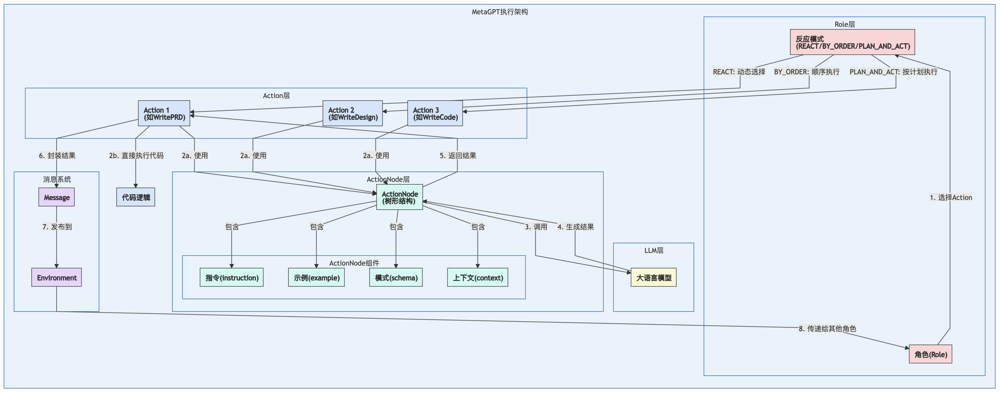

<style type="text/css">
    h1 { counter-reset: h2counter; }
    h2 { counter-reset: h3counter; }
    h3 { counter-reset: h4counter; }
    h4 { counter-reset: h5counter; }
    h5 { counter-reset: h6counter; }
    h6 { }
    h2:before {
      counter-increment: h2counter;
      content: counter(h2counter) ".\0000a0\0000a0";
    }
    h3:before {
      counter-increment: h3counter;
      content: counter(h2counter) "."
                counter(h3counter) ".\0000a0\0000a0";
    }
    h4:before {
      counter-increment: h4counter;
      content: counter(h2counter) "."
                counter(h3counter) "."
                counter(h4counter) ".\0000a0\0000a0";
    }
    h5:before {
      counter-increment: h5counter;
      content: counter(h2counter) "."
                counter(h3counter) "."
                counter(h4counter) "."
                counter(h5counter) ".\0000a0\0000a0";
    }
    h6:before {
      counter-increment: h6counter;
      content: counter(h2counter) "."
                counter(h3counter) "."
                counter(h4counter) "."
                counter(h5counter) "."
                counter(h6counter) ".\0000a0\0000a0";
    }
</style>

# Agent 技术综述

## Agent 概述

### 什么是 Agent

Agent 是一种能够自主感知环境、制定决策并采取行动以实现特定目标的 AI 系统。与传统 AI 系统不同，Agent 具有更强的自主性和目标导向性，能够在复杂、动态的环境中持续学习和适应。

### Agent 能做什么
- **豆包 Trae** 自主编码 IDE
  <video width="100%" height="auto" controls>
    <source src="./trae.mp4" type="video/mp4">
    您的浏览器不支持视频标签
  </video>
- **<a href="https://mgx.dev" target="_blank">MetaGPT-X </a>**  Agent 软件公司
  
- **Eko** 自主干活 Agent
  <video width="100%" height="auto" controls>
    <source src="./eko.mp4" type="video/mp4">
    您的浏览器不支持视频标签
  </video>
- **Agent Laboratory** 自主科研 Agent
  


### Agent 的核心组成
  

#### Planning

规划系统负责任务分解和执行策略的制定。它通常包括：

- **目标管理**：明确当前需要实现的目标
- **任务分解**：将复杂任务分解为可执行的子任务
- **策略生成**：为每个子任务选择合适的执行方法
- **反思机制**：评估执行结果，必要时调整计划

近期研究主要集中在利用 LLM 的推理能力进行复杂任务规划，如 Chain-of-Thought(CoT)、Tree-of-Thoughts(ToT) 等技术。通过 Prompt 工程可以显著提高 LLM 的规划和推理能力。

#### Memory

记忆系统使Agent能够存储和检索过去的信息和经验，通常分为：

- **短期记忆**：存储当前对话或任务的即时信息
- **长期记忆**：存储跨会话的持久性知识和经验
- **工作记忆**：临时处理和操作信息的空间
- **情景记忆**：存储特定场景或上下文的相关信息

记忆系统研究主要关注向量数据库的应用、检索技术的优化，以及记忆的优先级管理和遗忘机制。新兴的研究方向包括分层记忆和信息自动整合与抽象，例如Graph Rag， Agentic Rag等。

#### RAG

RAG (Retrieval Augmented Generation) 系统使 Agent 能够从知识库中检索相关信息并生成响应。它解决了大语言模型知识有限、幻觉和时效性问题：

- **信息检索**：基于用户查询或任务目标从外部知识库搜索相关信息
- **上下文增强**：将检索到的信息融入到 Prompt 中，扩展模型的知识范围
- **知识整合**：综合模型参数知识与检索信息生成更准确、更新的响应
- **相关性筛选**：评估和筛选检索内容的相关性，确保高质量的上下文增强

RAG 技术研究主要集中在索引构建、查询改写和结果优化方面。

##### 查询改写
- **HyDE (Hypothetical Document Embeddings)**：通过生成假设性文档来改进查询，解决查询-文档语义差异问题
- **Query Decomposition**：将复杂查询分解为多个简单子查询，以获取更全面的信息
- **Multi-perspective Rewriting**：从不同角度重写原始查询，增加检索覆盖面
- **Query Expansion**：通过同义词、相关术语扩展原始查询，提高召回率

##### RAG索引
- **传统 RAG**：使用向量数据库存储文档嵌入，通过相似度检索相关内容
- **Graph RAG**：构建知识图谱结构，捕捉实体间关系，支持更复杂的推理和关联检索
- **Agentic RAG**：利用 Agent 主动决策检索策略，可自主选择索引方法、查询改写和文档过滤
- **分层索引**：采用多级索引结构，从粗粒度到细粒度逐步缩小检索范围
- **多模态索引**：整合文本、图像、音频等多种模态的信息进行检索

##### 结果优化
- **ReRank技术**：使用ReRank模型等对初始检索结果进行精细化排序
- **冗余去除**：识别并过滤重复或高度相似的信息，提高上下文效率
- **长文本压缩**：在保留关键信息的前提下压缩检索内容，适应模型 token 限制

#### Tool

工具系统使 Agent 能够与外部资源交互，扩展其原有能力：

- **工具选择**：根据任务需求选择适当的工具
- **工具调用**：正确格式化请求并调用外部工具
- **结果解析**：理解工具返回的结果并整合到任务流程
- **错误处理**：检测工具调用失败并采取恢复策略

工具使用领域的研究重点包括提高工具选择的准确性、实现多工具协同工作、及开发更通用的工具调用接口。ReAct 和 Function Call 等技术进一步提高了 Agent 的工具使用能力。

#### Reflection

评估与反思系统使 Agent 能够评估自身表现并进行改进：

- **目标评估**：检查是否实现了既定目标
- **性能监控**：跟踪资源使用和执行效率
- **错误分析**：识别和分析失败的原因
- **自我改进**：根据反思结果调整策略

该领域研究重点包括开发更客观的自评估框架、通过对比学习改进决策质量，以及构建自我纠错和学习机制，例如 单元测试、人工评估、 鉴别模型、经验系统等。

## Eko

  

Eko 是由清华、复旦和斯坦福研究者联合开发的 Agent 开发框架，旨在让开发者通过简洁的代码和自然语言，快速构建可用于生产环境的"虚拟员工"。该框架使 AI 代理能够接管用户的电脑和浏览器，代替人类完成各种任务。

### Eko 核心技术创新

#### 混合智能体表示
Eko 将自然语言与程序语言实现无缝结合，使开发者能够通过自然语言构建复杂的 Agent 工作流。这种架构允许用户仅用一句话描述任务（如"分析股票数据"或"测试登录页面"），系统即可自动生成和执行完整的工作流程。

#### 环境感知架构
Eko 通过三层架构实现跨平台支持：
- **通用核心**：提供与环境无关的基本功能，如工作流管理和 LLM 集成
- **环境特定工具**：为不同环境（浏览器扩展/Web/Node.js）提供专属工具集
- **环境桥接**：负责环境检测、工具注册和安全控制


#### 层次化规划
Eko 采用两层规划架构：
- **规划层**：将用户需求转换为具有领域特定语言表示的任务图，描述子任务间的依赖关系
- **执行层**：根据任务图为每个子任务调用 LLM 生成具体的执行行为和工具调用

系统还实现了多步合并优化，当检测到连续的 LLM 调用时，自动整合为一次调用。

#### 视觉-交互联合感知
Visual-Interactive Element Perception 是 Eko 提出的浏览器感知方案，通过：
- 提取网页交互元素并映射到领域特定语言，生成高效的伪 HTML 代码
- 引入 Set-of-Mark 机制，确保视觉标识符与伪 HTML 中的标识符一一对应
- 优化图像压缩，降低资源消耗同时保持识别质量

这一技术大幅简化了 HTML 表示（如将 Google 首页从 22 万字符减少至 1,058 字符），提高处理速度和准确度。


### Eko 工作流程

<div style="text-align:center">
  
</div>

1. **工作流生成**：通过 LLM 分析用户输入的自然语言指令，自动生成包含多个节点的工作流
2. **工具集分配**：根据运行环境自动加载适合的工具集
3. **节点执行**：系统依次执行工作流中的节点，每个节点通过 LLM 决策使用哪些工具及参数
4. **人机协作**：关键步骤允许人类干预，确保流程可控并符合预期


#### 工作流生成

<div style="text-align:center">
  
</div>

Eko 的工作流生成过程涉及以下关键技术步骤：

1. **工具注册与环境识别**：系统首先通过 `toolRegistry` 对象收集当前环境下可用的所有工具。在 `Eko.generate()` 方法中，会根据运行环境（浏览器扩展/Web/Node.js）自动加载对应的工具集，并通过 `registerTool()` 进行注册。

2. **Prompt 构建**：通过 `createWorkflowPrompts()` 函数，系统基于已注册工具的 schema 和描述信息构建结构化的提示。这个提示包含两部分：
   - `systemPrompt`：定义工作流生成的规则和约束
     ```
     You are a workflow generation assistant that creates Eko framework workflows.
     The following tools are available:
     
     ${toolDescriptions}
     
     Generate a complete workflow that:
     1. Only uses the tools listed above
     2. Properly sequences tool usage based on dependencies
     3. Ensures each action has appropriate input/output schemas, and that the "tools" field in each action is populated with the sufficient subset of all available tools needed to complete the action
     4. Creates a clear, logical flow to accomplish the user's goal
     5. Includes detailed descriptions for each action, ensuring that the actions, when combined, is a complete solution to the user's problem
     6. You should always add a SubTask at the end of the workflow to summarize it, and this SubTask should always call the "summary_workflow" tool. It's dependencies should be all of the SubTasks
     ```
   - `userPrompt`：结合用户输入和工具能力描述
     ```
     Create a workflow for the following requirement: ${requirement}
     ```

3. **工作流图生成**：调用 `WorkflowGenerator.generateWorkflow()` 方法，使用 LLM 一次性生成完整的工作流 JSON 结构：
   ```javascript
   const response = await this.llmProvider.generateText(messages, {
     temperature: 0.7,
     maxTokens: 8192,
     tools: [createWorkflowGenerationTool(this.toolRegistry)],
     toolChoice: { type: 'tool', name: 'generate_workflow' }
   });
   ```

4. **工作流验证**：对生成的结果进行验证，确保每个节点引用的工具都存在：
   ```javascript
   for (const node of workflowData.nodes) {
     if (!this.toolRegistry.hasTools(node.action.tools)) {
       throw new Error(`Workflow contains undefined tools: ${node.action.tools}`);
     }
   }
   ```

5. **工作流对象实例化**：将 JSON 数据转换为可执行的 `Workflow` 对象：
   ```javascript
   return this.createWorkflowFromData(workflowData);
   ```

生成的工作流是一个有向无环图(DAG)，包含节点(Node)和边(Edge)，其中每个节点代表一个动作(Action)，边表示节点间的依赖关系。每个节点定义了可用的工具集(tools)、输入参数(input)和预期输出(output)，但并不直接指定具体要调用哪个工具，这一决策会在执行阶段由 LLM 动态决定。

工作流节点的数据结构示例：
```javascript
{
  id: "nodeId",                         // 节点唯一标识符
  name: "节点名称",                      // 节点名称，如不指定则使用id
  input: {                              // 节点输入规范
    type: "any",                        // 输入数据类型
    schema: {},                         // 输入数据模式
    value: undefined                    // 输入值
  },
  output: {                             // 节点输出规范
    type: "any",                        // 输出数据类型
    schema: {},                         // 输出数据模式
    value: undefined                    // 输出值
  },
  action: ActionImpl,                   // 节点执行的动作对象
  dependencies: []                      // 依赖的其他节点ID数组
}
```

#### 工具集分配

Eko 根据运行环境自动分配最适合的工具集，实现方式如下：

1. **环境自动检测**：在初始化阶段，系统通过 `loadTools()` 函数自动检测当前环境：
   ```javascript
   // 检测并加载适用于当前环境的工具
   const tools = await loadTools();
   const toolRegistry = new ToolRegistry();
   tools.forEach(tool => toolRegistry.registerTool(tool));
   ```

2. **差异化工具加载**：各环境加载不同类型的工具：
   - **Chrome 扩展环境**：加载完整的浏览器控制工具集，包括标签页管理、网页搜索、元素点击等
     
     | 分类 | 工具名称 | 功能描述 |
     | ---- | ------- | ------- |
     | **浏览器控制类** | `tab_management` | 标签页管理工具，可创建、切换和关闭标签页 |
     |  | `open_url` | 在当前或新标签页中打开指定URL |
     |  | `get_all_tabs` | 获取所有打开的标签页信息 |
     |  | `web_search` | 使用搜索引擎进行网络搜索 |
     | **页面交互类** | `element_click` | 精准点击页面元素 |
     |  | `find_element_position` | 定位页面元素的位置 |
     |  | `html_script` | 在页面上下文中执行JavaScript脚本 |
     |  | `extract_content` | 提取页面结构化内容 |
     | **系统功能类** | `screenshot` | 捕获页面或区域截图 |
     |  | `export_file` | 导出数据为文件 |
     |  | `request_login` | 处理页面登录请求 |
     | **高级功能类** | `browser_use` | 执行复杂的浏览器操作序列 |
     |  | `browser` | 封装底层Chrome扩展API |
     
   - **Web 环境**：加载受限的 DOM 操作工具集，专注于单页面内的交互
   - **Node.js 环境**：加载文件系统操作和命令执行工具

3. **动态工具注册**：通过 `registerTool()` 方法将工具注册到工具注册表中，每个工具都需要提供：
   - 名称和描述
   - 输入和输出的 JSON Schema
   - 执行函数

4. **工具过滤**：在工作流生成时，可通过参数指定特定工具子集：
   ```javascript
   const workflow = await eko.generate("任务描述", {
     tools: ["browser_use", "element_click", "extract_content"]
   });
   ```

工具集分配机制确保了 Agent 在不同环境中都能获得最合适的能力，同时保持代码的一致性和可移植性。

#### 节点执行

Eko 工作流执行过程体现了其"混合智能体表示"的核心理念，其技术实现包括：

1. **执行上下文构建**：节点执行前，系统首先创建 `ExecutionContext` 对象，包含：
   - 变量存储：用于节点间数据传递
   - 父级上下文：支持嵌套执行
   - 钩子系统：允许外部监听和干预

2. **动态工具调用**：`Action.execute()` 方法的核心逻辑：
   ```javascript
   async execute(input, context) {
     // 构建执行提示
     const messages = this.buildPrompt(context, input);
     
     // LLM 动态决策工具调用
     const response = await this.llmProvider.generateText(messages, {
       tools: this.tools.map(t => this.toolRegistry.getToolDefinition(t))
     });
     
     // 执行工具调用并处理结果
     if (response.toolCalls && response.toolCalls.length > 0) {
       return await this.executeToolCalls(response.toolCalls, context);
     }
     
     return response.content;
   }
   ```

3. **多轮对话处理**：节点执行支持多轮对话，每轮包含：
   - LLM 生成工具调用
   - 执行工具并获取结果
   - 将结果反馈给 LLM 进行后续决策

4. **错误处理与重试**：通过错误处理机制捕获工具调用异常，并提供给 LLM 进行修复或重试决策。

节点执行阶段体现了 Eko 的智能决策特性，不同于传统自动化框架的硬编码工具调用，而是利用 LLM 动态选择和组合工具，增强了系统的适应性和鲁棒性。

#### 人机协作

Eko 的生产级干预机制，实现了优雅的人机协作：

1. **钩子系统**：通过 `hooks` 机制提供执行过程的可观察性和可干预性：
   ```javascript
   // 注册钩子监听节点执行前事件
   eko.hooks.on('beforeNodeExecution', async (event) => {
     // 获取节点信息
     const { nodeId, input, context } = event;
     
     // 可以修改输入或取消执行
     if (needUserApproval(nodeId)) {
       const approved = await requestUserApproval(nodeId, input);
       if (!approved) {
         event.preventDefault(); // 取消执行
       }
     }
   });
   ```

  
通过 `needUserApproval` 函数允许开发者定义何时需要人工审批：

```javascript
   // 配置需要用户审批的条件
   function needUserApproval(node, context) {
     // 检查节点是否包含高风险操作
     const highRiskTools = ['export_file', 'html_script'];
     const usesHighRiskTool = node.action.tools.some(tool => 
       highRiskTools.includes(tool.name)
     );
     
     // 检查是否涉及敏感数据
     const hasSensitiveData = Object.keys(context.variables)
       .some(key => key.includes('password') || key.includes('credential'));
     
     // 返回是否需要用户审批
     return usesHighRiskTool || hasSensitiveData;
   }
```
 

2. **执行暂停与恢复**：通过 `workflow.pause()` 和 `workflow.resume()` 方法支持工作流的暂停和恢复，使人类可以在关键节点进行检查和干预。

3. **状态持久化**：支持将工作流状态序列化和反序列化，便于长时间运行的工作流断点续传：
   ```javascript
   // 保存当前状态
   const state = workflow.serialize();
   
   // 从保存的状态恢复
   const restoredWorkflow = eko.restoreWorkflow(state);
   await restoredWorkflow.resume();
   ```

4. **动态工作流修改**：允许在执行过程中修改工作流：
   ```javascript
   // 动态修改现有工作流
   const modifiedWorkflow = await eko.modify(workflow, "增加数据验证步骤");
   ```

   动态工作流修改通常在以下情况下触发：

   - **执行过程中发现工作流不足**：当现有工作流无法处理特定场景
     - *发现机制*：通过工作流的执行统计数据（成功率、平均执行时间）自动识别问题点
     - *监控工具*：`eko.monitor.detectBottlenecks(workflow)`方法分析工作流性能瓶颈
     - *异常日志分析*：记录并分析运行时出现的异常类型和频率，识别模式
     ```javascript
     // 工作流效率监控示例
     eko.monitor.onMetricsUpdate(metrics => {
       // 当某个节点失败率超过阈值时
       if (metrics.failureRate > 0.2) {
         // 提示需要增强此节点的容错能力
         console.log(`Node ${metrics.nodeId} needs resilience enhancement`);
       }
     });
     ```

   - **用户反馈需要调整**：根据人类的反馈进行调整
     - *反馈渠道*：通过工作流执行UI提供的反馈接口收集
     - *结构化评估*：用户可以对节点执行结果进行评分和添加建议
     - *批注系统*：支持在工作流图上直接添加修改建议
     ```javascript
     // 用户反馈收集与处理
     eko.feedback.collectAndProcess(workflow, {
       onFeedbackReceived: async (feedback) => {
         // 将用户反馈转化为工作流增强指令
         const enhancementPrompt = eko.feedback.translateToEnhancementPrompt(feedback);
         // 应用修改
         return await eko.modify(workflow, enhancementPrompt);
       }
     });
     ```

   - **环境条件变化**：当执行环境发生变化需要适应新情况
     - *网页结构变更检测*：通过DOM结构哈希对比识别目标网站的变化
     - *API响应格式变更*：通过模式匹配监测API返回结构变化
     - *性能条件变化*：检测网络或系统负载变化并调整工作流优化策略
     ```javascript
     // 环境变化监测示例
     eko.environmentMonitor.watchForChanges({
       // 定义需要监控的环境因素
       factors: ['domStructure', 'apiResponses', 'networkConditions'],
       onChangesDetected: async (changes) => {
         // 针对不同变化类型生成适应策略
         const adaptationStrategy = await eko.adapt.generateStrategy(changes);
         // 应用到工作流
         return await eko.modify(workflow, adaptationStrategy);
       }
     });
     ```

   - **错误处理增强**：为处理执行中遇到的错误添加额外的恢复或验证步骤
     - *自动重试策略*：为频繁失败的网络请求节点添加指数退避重试
     - *条件分支注入*：在关键节点增加条件分支以处理异常情况

`eko.modify()` 方法是工作流动态修改的核心，其内部实现如下：

```javascript
/**
 * 修改现有工作流
 * @param {Workflow} workflow - 需要修改的工作流对象
 * @param {string} prompt - 描述如何修改工作流的自然语言指令
 * @returns {Promise<Workflow>} 修改后的工作流
 */
public async modify(workflow: Workflow, prompt: string): Promise<Workflow> {
  const generator = this.workflowGeneratorMap.get(workflow) as WorkflowGenerator;
  workflow = await generator.modifyWorkflow(prompt, this.ekoConfig);
  this.workflowGeneratorMap.set(workflow, generator);
  return workflow;
}
```

在 `WorkflowGenerator` 类中，`modifyWorkflow` 方法实现如下：

```javascript
async modifyWorkflow(prompt: string, ekoConfig: EkoConfig): Promise<Workflow> {
  return this.doGenerateWorkflow(prompt, true, ekoConfig);
}
```

`doGenerateWorkflow` 方法中处理修改逻辑的部分：

```javascript
private async doGenerateWorkflow(prompt: string, modify: boolean, ekoConfig: EkoConfig): Promise<Workflow> {
  // Create prompts with current set of tools
  const prompts = createWorkflowPrompts(this.toolRegistry.getToolDefinitions());

  let messages: Message[] = [];
  if (modify) {
    messages = this.message_history;
    messages.push({
      role: 'user',
      content: prompts.modifyUserPrompt(prompt),
    });
  } else {
    messages = this.message_history = [
      {
        role: 'system',
        content: prompts.formatSystemPrompt(),
      },
      {
        role: 'user',
        content: prompts.formatUserPrompt(prompt),
      },
    ];
  }
  // 后续调用LLM生成工作流的逻辑...
}
```

修改工作流的用户 prompt 非常简单：

```javascript
modifyUserPrompt: (prompt: string) =>
  `Modify workflow: ${prompt}`,
```

这些机制共同确保了 Agent 系统的可控性和透明度，使其更适合生产环境应用，解决了自动化与人类监管之间的平衡问题。

### Eko 核心工具实现

相比于其他 Agent 框架，Eko 的一大亮点就是能够让 Agent “看到” 当前的浏览器页面。
这得益于其实现的一系列 Agent 与网页交互的强大工具。以下是几个核心工具的实现分析：

#### browser_use 工具

`browser_use` 工具是 Eko 中最核心的浏览器交互组件，它通过实现 Tool 接口，为 AI 提供了与网页进行自然交互的能力。该工具实现了一个完整的浏览器操作系统，使 AI 能够像人类用户一样浏览网页、点击元素、输入文本和提取内容。

在实现上，该工具利用 Chrome 扩展 API 与浏览器进行通信。核心是 execute 方法，根据传入的 action 参数执行不同的浏览器操作。当需要与页面元素交互时，工具会先通过 injectScript 将辅助脚本注入到网页中，然后使用 executeScript 在页面上下文中执行 JavaScript 代码。

对于元素定位，工具采用 XPath 精确定位复杂 DOM 结构中的元素。在执行点击、输入等操作前，工具会先通过 `extractOperableElements` 提取页面可交互元素，这个函数首先使用 CSS 选择器提取所有标准交互元素（链接、按钮、输入框等），然后使用 TreeWalker 遍历 DOM 树找出短文本元素作为辅助信息。每个元素都被赋予唯一 ID 并转换为伪 HTML 结构来识别页面元素。这种方法使 AI 能够"看到"页面结构。


```javascript
import { BrowserUseParam, BrowserUseResult } from '../../types/tools.types';
import { Tool, InputSchema, ExecutionContext } from '../../types/action.types';
import { getWindowId, getTabId, sleep, injectScript, executeScript } from '../utils';
import * as browser from './browser';

/**
 * Browser Use 工具类 - 提供完整的网页浏览器交互能力
 * 该类实现了Tool接口，支持截图、元素提取、点击、输入文本等多种浏览器操作
 */
export class BrowserUse implements Tool<BrowserUseParam, BrowserUseResult> {
  name: string;                // 工具名称
  description: string;         // 工具的详细描述，用于向AI模型说明功能
  input_schema: InputSchema;   // 输入参数的结构定义

  constructor() {
    this.name = 'browser_use';
    this.description = `Use structured commands to interact with the browser, manipulating page elements through screenshots and webpage element extraction.
* This is a browser GUI interface where you need to analyze webpages by taking screenshots and extracting page element structures, and specify action sequences to complete designated tasks.
* Before any operation, you must first call the \`screenshot_extract_element\` command, which will return the browser page screenshot and structured element information, both specially processed.
* ELEMENT INTERACTION:
   - Only use indexes that exist in the provided element list
   - Each element has a unique index number (e.g., "[33]:<button>")
   - Elements marked with "[]:" are non-interactive (for context only)
* NAVIGATION & ERROR HANDLING:
   - If no suitable elements exist, use other functions to complete the task
   - If stuck, try alternative approaches
   - Handle popups/cookies by accepting or closing them
   - Use scroll to find elements you are looking for`;
    this.input_schema = {
      type: 'object',
      properties: {
        action: {
          type: 'string',
          description: `The action to perform. The available actions are:
* \`screenshot_extract_element\`: Take a screenshot of the web page and extract operable elements.
  - Screenshots are used to understand page layouts, with labeled bounding boxes corresponding to element indexes. Each bounding box and its label share the same color, with labels typically positioned in the top-right corner of the box.
  - Screenshots help verify element positions and relationships. Labels may sometimes overlap, so extracted elements are used to verify the correct elements.
  - In addition to screenshots, simplified information about interactive elements is returned, with element indexes corresponding to those in the screenshots.
* \`input_text\`: Enter a string in the interactive element.
* \`click\`: Click to element.
* \`right_click\`: Right-click on the element.
* \`double_click\`: Double-click on the element.
* \`scroll_to\`: Scroll to the specified element.
* \`extract_content\`: Extract the text content of the current webpage.
* \`get_dropdown_options\`: Get all options from a native dropdown element.
* \`select_dropdown_option\`: Select dropdown option for interactive element index by the text of the option you want to select.`,
          enum: [
            'screenshot_extract_element',  // 截图并提取页面元素
            'input_text',                  // 向元素输入文本
            'click',                       // 点击元素
            'right_click',                 // 右键点击元素
            'double_click',                // 双击元素
            'scroll_to',                   // 滚动到指定元素
            'extract_content',             // 提取页面内容
            'get_dropdown_options',        // 获取下拉选项列表
            'select_dropdown_option',      // 选择下拉选项
          ],
        },
        index: {
          type: 'integer',
          description:
            'index of element, Operation elements must pass the corresponding index of the element',
        },
        text: {
          type: 'string',
          description: 'Required by `action=input_text` and `action=select_dropdown_option`',
        },
      },
      required: ['action'],
    };
  }

  /**
   * 执行浏览器操作的核心方法
   * 
   * @param {*} params { action: 'input_text', index: 1, text: 'string' }
   * @returns > { success: true, image?: { type: 'base64', media_type: 'image/jpeg', data: '/9j...' }, text?: string }
   */
  async execute(context: ExecutionContext, params: BrowserUseParam): Promise<BrowserUseResult> {
    try {
      // 参数验证：确保params存在且包含action属性
      if (params === null || !params.action) {
        throw new Error('Invalid parameters. Expected an object with a "action" property.');
      }
      
      // 获取当前标签页ID
      let tabId: number;
      try {
        tabId = await getTabId(context);
        if (!tabId || !Number.isInteger(tabId)) {
          throw new Error('Could not get valid tab ID');
        }
      } catch (e) {
        console.error('Tab ID error:', e);
        return { success: false, error: 'Could not access browser tab' };
      }
      
      // 获取窗口ID和元素选择器映射
      let windowId = await getWindowId(context);
      let selector_map = context.selector_map;
      let selector_xpath;
      
      // 如果提供了元素索引，获取对应的XPath选择器
      if (params.index != null && selector_map) {
        selector_xpath = selector_map[params.index]?.xpath;
        if (!selector_xpath) {
          throw new Error('Element does not exist');
        }
      }
      
      let result;
      // 根据不同的action执行对应的浏览器操作
      switch (params.action) {
        case 'input_text':
          // 向指定元素输入文本
          if (params.index == null) {
            throw new Error('index parameter is required');
          }
          if (params.text == null) {
            throw new Error('text parameter is required');
          }
          await browser.clear_input_by(tabId, selector_xpath, params.index); // 先清除原有输入
          result = await browser.type_by(tabId, params.text, selector_xpath, params.index); // 输入新文本
          await sleep(200); // 等待输入完成
          break;
        case 'click':
          // 左键点击指定元素
          if (params.index == null) {
            throw new Error('index parameter is required');
          }
          result = await browser.left_click_by(tabId, selector_xpath, params.index);
          await sleep(100); // 等待点击操作完成
          break;
        case 'right_click':
          // 右键点击指定元素
          if (params.index == null) {
            throw new Error('index parameter is required');
          }
          result = await browser.right_click_by(tabId, selector_xpath, params.index);
          await sleep(100);
          break;
        case 'double_click':
          // 双击指定元素
          if (params.index == null) {
            throw new Error('index parameter is required');
          }
          result = await browser.double_click_by(tabId, selector_xpath, params.index);
          await sleep(100);
          break;
        case 'scroll_to':
          // 滚动到指定元素位置
          if (params.index == null) {
            throw new Error('index parameter is required');
          }
          result = await browser.scroll_to_by(tabId, selector_xpath, params.index);
          await sleep(500); // 等待滚动完成
          break;
        case 'extract_content':
          // 提取当前页面的文本内容
          let tab = await chrome.tabs.get(tabId);
          await injectScript(tabId); // 注入所需的脚本
          await sleep(200);
          let content = await executeScript(tabId, () => {
            return eko.extractHtmlContent(); // 调用页面中的函数提取内容
          }, []);
          result = {
            title: tab.title,   // 页面标题
            url: tab.url,       // 页面URL
            content: content,   // 提取的内容
          };
          break;
        case 'get_dropdown_options':
          // 获取下拉菜单的所有选项
          if (params.index == null) {
            throw new Error('index parameter is required');
          }
          result = await browser.get_dropdown_options(tabId, selector_xpath, params.index);
          break;
        case 'select_dropdown_option':
          // 根据文本选择下拉菜单选项
          if (params.index == null) {
            throw new Error('index parameter is required');
          }
          if (params.text == null) {
            throw new Error('text parameter is required');
          }
          result = await browser.select_dropdown_option(
            tabId,
            params.text,
            selector_xpath,
            params.index
          );
          break;
        case 'screenshot_extract_element':
          // 截图并提取页面元素，这是其他交互操作前的必要步骤
          await sleep(100);
          await injectScript(tabId, 'build_dom_tree.js'); // 注入DOM树构建脚本
          await sleep(100);
          let element_result = await executeScript(tabId, () => {
            return (window as any).get_clickable_elements(true); // 调用页面脚本获取可交互元素
          }, []);
          context.selector_map = element_result.selector_map; // 更新选择器映射
          let screenshot = await browser.screenshot(windowId, true); // 获取页面截图
          await executeScript(tabId, () => {
            return (window as any).remove_highlight(); // 移除元素高亮
          }, []);
          result = { image: screenshot.image, text: element_result.element_str }; // 返回图像和元素信息
          break;
        default:
          throw Error(
            `Invalid parameters. The "${params.action}" value is not included in the "action" enumeration.`
          );
      }
      
      // 返回成功结果
      if (result) {
        return { success: true, ...result };
      } else {
        return { success: false };
      }
    } catch (e: any) {
      console.error('Browser use error:', e);
      return { success: false, error: e?.message };
    }
  }

  destroy(context: ExecutionContext) {
    delete context.selector_map;
  }
}

```
#### extract_content 工具

`extract_content` 工具是 Eko 中专门用于提取网页内容的组件，它为 AI 提供了获取当前网页文本内容的能力。

`extractHtmlContent` 优先从语义化结构（如 main 和 article 元素）中提取内容，这些元素通常包含网页的主要信息。如果找不到这些元素，则会回退到使用整个 body 的文本内容。

工具返回的结果包含三个部分：页面标题、URL 和提取的文本内容，使 AI 能够全面了解网页信息。
```javascript
import { ExtractContentResult } from '../../types/tools.types';
import { Tool, InputSchema, ExecutionContext } from '../../types/action.types';
import { getTabId, executeScript, injectScript, sleep } from '../utils';

/**
 * Extract Page Content 类
 * 该工具用于提取当前网页的完整文本内容，无需任何参数即可执行
 */
export class ExtractContent implements Tool<any, ExtractContentResult> {
  name: string;                // 工具名称标识
  description: string;         // 工具功能描述
  input_schema: InputSchema;   // 输入参数结构定义

  constructor() {
    this.name = 'extract_content';
    this.description = 'Extract the text content of the current webpage';
    this.input_schema = {
      type: 'object',
      properties: {},  // 空对象表示不需要任何输入参数
    };
  }

  /**
   * Extract Page Content
   * 
   * @param {*} params {}
   * @returns > { tabId, result: { title, url, content }, success: true }
   */
  async execute(context: ExecutionContext, params: any): Promise<ExtractContentResult> {
    let tabId = await getTabId(context);  // 获取当前活动标签页ID
    let tab = await chrome.tabs.get(tabId);  // 获取标签页详细信息（包含标题和URL）
    await injectScript(tabId);  // 向页面注入必要的内容提取脚本
    await sleep(500);  // 等待500毫秒确保脚本加载完成
    let content = await executeScript(tabId, () => {
      return eko.extractHtmlContent();  // 执行页面中的内容提取函数
    }, []);
    return {
      tabId,  // 返回标签页ID
      result: {
        title: tab.title,  // 返回页面标题
        url: tab.url,      // 返回页面URL
        content: content,  // 返回提取的页面内容文本
      }
    } as ExtractContentResult;  // 转换为ExtractContentResult类型
  }
}

```
`extractHtmlContent` 方法实现：
```javascript
eko.extractHtmlContent = function (element) {
    element = element || document.body  // 默认从body元素开始提取
    let main = element.querySelector('main')  // 首先尝试查找main标签
    let content = ''
    if (main) {
        // 如果存在main标签，优先从main中提取内容
        let articles = main.querySelectorAll('article')  // 查找article标签
        if (articles && articles.length > 0) {
            // 如果main中有article标签，提取所有article的文本
            for (let i = 0; i < articles.length; i++) {
                content += articles[i].innerText.trim() + '\n'
            }
        } else {
            // 如果main中没有article标签，直接提取main的文本
            content += main.innerText.trim()
        }
    } else {
        // 如果不存在main标签，直接查找article标签
        let articles = element.querySelectorAll('article')
        if (articles && articles.length > 0) {
            // 提取所有article的文本
            for (let i = 0; i < articles.length; i++) {
                content += articles[i].innerText.trim() + '\n'
            }
        }
    }
    content = content.trim()
    if (!content) {
        // 如果上述方法都没有提取到内容，则使用整个元素的文本
        content = element.innerText
    }
    // 清理文本：合并多个换行和空格，去除首尾空白
    return content.replaceAll(/\n+/g, '\n').replaceAll(/ +/g, ' ').trim()
}
```

#### html_script 工具
`html_script` 工具是 Eko 中的辅助工具集合，提供了一系列用于操作网页 DOM 元素的实用函数，被其他工具如 browser_use 和 find_element_position 调用。

主要功能包括：

`exportFile`：将内容导出为文件并下载
`xpath`：生成元素的 XPath 路径
`queryWithXpath`：根据 XPath 查询元素
`extractOperableElements`：提取页面可交互元素，生成伪 HTML 结构
`clickOperableElement`：点击指定 ID 的可操作元素
`getOperableElementRect`：获取元素的位置和尺寸信息

```javascript
import { ElementRect } from '../../types/tools.types';

export function exportFile(filename: string, type: string, content: string) {
  const blob = new Blob([content], { type: type });
  const link = document.createElement('a');
  link.href = URL.createObjectURL(blob);
  link.download = filename;
  document.body.appendChild(link);
  link.click();
  document.body.removeChild(link);
  URL.revokeObjectURL(link.href);
}

export function xpath(element: any): string {
  if (element == document.body) {
    return '/html/' + element.tagName.toLowerCase();
  }
  if (element.parentNode instanceof ShadowRoot) {
    let shadowRoot = element.parentNode as ShadowRoot;
    let parent = (shadowRoot.getRootNode() as any).host;
    return xpath(parent) + '//' + element.tagName.toLowerCase();
  } else {
    let sp;
    let parent;
    if (element.parentNode instanceof ShadowRoot) {
      sp = '//';
      let shadowRoot = element.parentNode as ShadowRoot;
      parent = (shadowRoot.getRootNode() as any).host;
    } else {
      sp = '/';
      parent = element.parentNode;
    }
    let siblings = parent.childNodes;
    if (siblings.length == 1) {
      return xpath(parent) + sp + element.tagName.toLowerCase();
    } else {
      let ix = 1;
      for (let i = 0, l = siblings.length; i < l; i++) {
        let sibling = siblings[i];
        if (sibling == element) {
          return xpath(parent) + sp + element.tagName.toLowerCase() + '[' + ix + ']';
        } else if (sibling.nodeType == 1 && sibling.tagName == element.tagName) {
          ix++;
        }
      }
      return '';
    }
  }
}

export function queryWithXpath(xpath: string) {
  let xpaths = xpath.split('//');
  if (xpaths.length == 1) {
    return document.evaluate(xpath, document, null, XPathResult.FIRST_ORDERED_NODE_TYPE, null)
      .singleNodeValue;
  }
  let element: any = document;
  for (let i = 0; i < xpaths.length; i++) {
    let _element = null;
    if (element instanceof ShadowRoot) {
      let _xpaths = xpaths[i].split('/');
      let current = _xpaths[0].toLowerCase();
      let ix = 1;
      for (let j = 0; j < element.childNodes.length; j++) {
        let tagName = (element.childNodes[j] as any).tagName;
        if (!tagName) {
          ix++;
          continue;
        }
        tagName = tagName.toLowerCase();
        if (current == tagName || current == tagName + '[' + ix + ']') {
          element = element.childNodes[j];
          let _xpath = _xpaths.slice(1).join('/');
          _element = document.evaluate(
            _xpath,
            element,
            null,
            XPathResult.FIRST_ORDERED_NODE_TYPE,
            null
          ).singleNodeValue as any;
          break;
        } else {
          ix++;
        }
      }
    } else {
      _element = document.evaluate(
        xpaths[i],
        element,
        null,
        XPathResult.FIRST_ORDERED_NODE_TYPE,
        null
      ).singleNodeValue as any;
    }
    if (!_element) {
      return null;
    }
    if (_element.shadowRoot) {
      element = _element.shadowRoot;
    } else {
      element = _element;
    }
  }
  return element != document ? element : null;
}

/**
 * Extract the elements related to html operability and wrap them into pseudo-html code.
 */
export function extractOperableElements(): string {
  // visible
  const isElementVisible = (element: any) => {
    const style = window.getComputedStyle(element);
    return (
      style.display !== 'none' &&
      style.visibility !== 'hidden' &&
      style.opacity !== '0' &&
      element.offsetWidth > 0 &&
      element.offsetHeight > 0
    );
  };

  // element original index
  const getElementIndex = (element: any) => {
    const xpath = document.evaluate(
      'preceding::*',
      element,
      null,
      XPathResult.ORDERED_NODE_SNAPSHOT_TYPE,
      null
    );
    return xpath.snapshotLength;
  };

  // exclude
  const addExclude = (excludes: any, children: any) => {
    for (let i = 0; i < children.length; i++) {
      excludes.push(children[i]);
      if (children[i].children) {
        addExclude(excludes, children[i].children);
      }
    }
  };

  // { pseudoId: element }
  let elementMap: any = {};
  let nextId = 1;
  let elements = [] as any[];
  let excludes = [] as any[];

  // operable element
  const operableSelectors = 'a, button, input, textarea, select';
  document.querySelectorAll(operableSelectors).forEach((element: any) => {
    if (isElementVisible(element) && excludes.indexOf(element) == -1) {
      const id = nextId++;
      elementMap[id.toString()] = element;

      const tagName = element.tagName.toLowerCase();
      const attributes = Array.from(element.attributes)
        .filter((attr: any) =>
          ['id', 'name', 'type', 'value', 'href', 'title', 'placeholder'].includes(attr.name)
        )
        .map((attr: any) => `${attr.name == 'id' ? 'target' : attr.name}="${attr.value}"`)
        .join(' ');

      elements.push({
        originalIndex: getElementIndex(element),
        id: id,
        html: `<${tagName} id="${id}" ${attributes}>${tagName == 'select' ? element.innerHTML : element.innerText || ''}</${tagName}>`,
      });

      addExclude(excludes, element.children);
    }
  });

  // short text element
  const textWalker = document.createTreeWalker(document.body, NodeFilter.SHOW_ELEMENT, {
    acceptNode: function (node: any) {
      if (node.matches(operableSelectors) || excludes.indexOf(node) != -1) {
        // skip
        return NodeFilter.FILTER_SKIP;
      }

      // text <= 100
      const text = node.innerText?.trim();
      if (
        isElementVisible(node) &&
        text &&
        text.length <= 100 &&
        text.length > 0 &&
        node.children.length === 0
      ) {
        return NodeFilter.FILTER_ACCEPT;
      }

      // skip
      return NodeFilter.FILTER_SKIP;
    },
  });

  let currentNode: any;
  while ((currentNode = textWalker.nextNode())) {
    const id = nextId++;
    elementMap[id.toString()] = currentNode;

    const tagName = currentNode.tagName.toLowerCase();
    elements.push({
      originalIndex: getElementIndex(currentNode),
      id: id,
      html: `<${tagName} id="${id}">${currentNode.innerText.trim()}</${tagName}>`,
    });
  }

  // element sort
  elements.sort((a, b) => a.originalIndex - b.originalIndex);

  // cache
  (window as any).operableElementMap = elementMap;
  // pseudo html
  return elements.map((e) => e.html).join('\n');
}

export function clickOperableElement(id: any): any {
  let element = (window as any).operableElementMap[id];
  if (!element) {
    return false;
  }
  if (element.click) {
    element.click();
  } else {
    element.dispatchEvent(
      new MouseEvent('click', {
        view: window,
        bubbles: true,
        cancelable: true,
      })
    );
  }
  return true;
}

export function getOperableElementRect(id: any): ElementRect | null {
  let element = (window as any).operableElementMap[id];
  if (!element) {
    return null;
  }
  const rect = element.getBoundingClientRect();
  return {
    left: rect.left + window.scrollX,
    top: rect.top + window.scrollY,
    right: rect.right + window.scrollX,
    bottom: rect.bottom + window.scrollY,
    width: rect.right - rect.left,
    height: rect.bottom - rect.top,
  } as ElementRect;
}


```
#### find_element_position 工具
`find_element_position` 工具是 Eko 中的元素定位组件，它通过自然语言描述来定位网页上的元素，为 AI 提供了一种更自然的方式与网页交互。

该工具的实现依赖于多个步骤：
1. 首先通过 `screenshot` 函数捕获当前页面截图.
2. 使用 `extractOperableElements` 提取页面上所有可交互元素，生成伪 HTML 结构.
3. 将截图、伪 HTML 和用户的任务描述一起发送给 LLM，让 LLM 分析页面内容并确定哪个元素最符合描述.
4. LLM 返回匹配元素的 ID 后，工具使用 `getOperableElementRect` 函数获取该元素的精确位置和尺寸信息（包括左上角和右下角坐标、宽度和高度）.

这种设计使 AI 能够理解像"点击登录按钮"这样的自然语言指令，并将其转换为精确的网页操作.
```javascript
import { LLMParameters, Message } from '../../types/llm.types';
import { Tool, InputSchema, ExecutionContext } from '../../types/action.types';
import { TaskPrompt, ElementRect } from '../../types/tools.types';
import { executeScript, getTabId, getWindowId } from '../utils';
import { extractOperableElements, getOperableElementRect } from './html_script';
import { screenshot } from './browser';

/**
 * Find Element Position
 */
export class FindElementPosition implements Tool<TaskPrompt, ElementRect | null> {
  name: string;
  description: string;
  input_schema: InputSchema;

  constructor() {
    this.name = 'find_element_position';
    this.description = 'Locate Element Coordinates through Task Prompts';
    this.input_schema = {
      type: 'object',
      properties: {
        task_prompt: {
          type: 'string',
          description: 'Task prompt, eg: find the search input box',
        },
      },
      required: ['task_prompt'],
    };
  }

  async execute(context: ExecutionContext, params: TaskPrompt): Promise<ElementRect | null> {
    if (typeof params !== 'object' || params === null || !params.task_prompt) {
      throw new Error('Invalid parameters. Expected an object with a "task_prompt" property.');
    }
    let result: ElementRect | null;
    let task_prompt = params.task_prompt;
    try {
      result = await executeWithHtmlElement(context, task_prompt);
    } catch (e) {
      console.log(e);
      result = null;
    }
    if (!result) {
      result = await executeWithBrowserUse(context, task_prompt);
    }
    return result;
  }
}

async function executeWithHtmlElement(
  context: ExecutionContext,
  task_prompt: string
): Promise<ElementRect | null> {
  let tabId = await getTabId(context);
  let pseudoHtml = await executeScript(tabId, extractOperableElements, []);
  let messages: Message[] = [
    {
      role: 'user',
      content: `# Task
Find the element ID that the user needs to operate on in the webpage HTML, and if the element does not exist, do nothing.
Output JSON format, no explanation required.

# User input
${task_prompt}

# Output example (when the element exists)
{"elementId": "1"}

# Output example (when the element does not exist)
{"elementId": null}

# HTML
${pseudoHtml}
`,
    },
  ];
  let llm_params: LLMParameters = { maxTokens: 1024 };
  let response = await context.llmProvider.generateText(messages, llm_params);
  let content =
    typeof response.content == 'string' ? response.content : (response.content as any[])[0].text;
  let json = content.substring(content.indexOf('{'), content.indexOf('}') + 1);
  let elementId = JSON.parse(json).elementId;
  if (elementId) {
    return await executeScript(tabId, getOperableElementRect, [elementId]);
  }
  return null;
}

async function executeWithBrowserUse(
  context: ExecutionContext,
  task_prompt: string
): Promise<ElementRect | null> {
  let tabId = await getTabId(context);
  let windowId = await getWindowId(context);
  let screenshot_result = await screenshot(windowId, false);
  let messages: Message[] = [
    {
      role: 'user',
      content: [
        {
          type: 'image',
          source: screenshot_result.image,
        },
        {
          type: 'text',
          text: 'Find the element: ' + task_prompt,
        },
      ],
    },
  ];
  let llm_params: LLMParameters = {
    maxTokens: 1024,
    toolChoice: {
      type: 'tool',
      name: 'get_element_by_coordinate',
    },
    tools: [
      {
        name: 'get_element_by_coordinate',
        description: 'Retrieve element information based on coordinate',
        input_schema: {
          type: 'object',
          properties: {
            coordinate: {
              type: 'array',
              description:
                '(x, y): The x (pixels from the left edge) and y (pixels from the top edge) coordinates.',
            },
          },
          required: ['coordinate'],
        },
      },
    ],
  };
  let response = await context.llmProvider.generateText(messages, llm_params);
  let input = response.toolCalls[0].input;
  let coordinate = input.coordinate as [number, number];

  return {
    left: coordinate[0],
    top: coordinate[1],
  } as ElementRect;
}

```
## MetaGPT

  

MetaGPT 是一个多 Agent 框架，它将不同角色分配给 LLM，使它们共同协作来处理复杂任务。该项目由清华大学、复旦大学和斯坦福大学共同研究开发，旨在创建一个"软件公司"式的多 Agent 系统。

MetaGPT 的核心理念是 `Code = SOP(Team)`，即 Code 是通过标准操作流程（SOP）指导的团队协作产物。只需一行需求输入，MetaGPT 就能输出用户故事、竞争分析、需求分析、数据结构、API设计以及项目代码。

### 核心技术

#### 多 Agent 架构
- **基于角色的 Agent 系统**
  MetaGPT 使用 Role 作为 Agent 的基础抽象，每个角色（如产品经理、架构师、工程师等）都是特定领域的专家，拥有自己的专业知识、目标和约束条件。每个角色被实现为独立的对象，包含自身的记忆系统、行动集合和决策逻辑，可以根据上下文状态执行不同的行动。
- **团队协作机制**
  通过 Team 组织多个角色形成协作团队，类似软件公司的组织结构。Team 负责角色的雇佣(hire)、投资(invest)和运行(run)等管理职能，为所有角色提供统一的环境上下文，确保角色间能够协同工作。团队可以异步执行多轮对话，在预设的 SOP 下共同完成复杂任务。
- **消息传递机制**
  使用 Environment 作为中央消息枢纽，实现了基于发布-订阅模式的消息路由系统。角色之间不直接通信，而是通过向环境发布消息和从环境接收消息来交互。角色可以通过订阅特定标签的消息来过滤自己感兴趣的信息，形成有向的工作流。

#### 标准操作流程
- **产品开发流程自动化**
  MetaGPT实现了软件开发全流程的自动化，从需求分析到代码实现。当用户提供一行需求描述后，系统会按照预设的开发流程依次执行：需求分析 → 用户故事编写 → 竞争分析 → 产品需求文档(PRD)生成 → 系统架构设计 → API设计 → 数据结构定义 → 代码实现 → 测试。每个阶段都有对应的角色和行动(Action)负责完成，确保产出符合软件工程规范。

- **任务规划与执行**
  系统支持三种执行模式：REACT、BY_ORDER和PLAN_AND_ACT。在REACT模式下，角色会经历观察(Observe)→思考(Think)→行动(Act)的循环；在BY_ORDER模式下，角色按照预定义的行动序列执行任务；在PLAN_AND_ACT模式下，系统先生成整体计划，再逐步执行。 

#### 工具整合
- **基于环境感知的架构**
  MetaGPT 设计了可扩展的环境适配层，使 Agent 能够与各种外部工具和资源交互。系统支持包括本地开发环境、搜索引擎、代码仓库、文件系统、数据库等多种资源访问。智能体可以感知当前环境状态并根据需要调用合适的工具，例如通过调用 Shell 命令执行代码、使用 Git 进行版本控制、通过 API 访问外部服务等。
- **代码生成和质量控制**
  系统集成了多层次的代码生成和质量控制机制。在生成阶段，Engineer 能够根据架构设计自动生成符合规范的代码框架和实现；在质量控制阶段，系统支持自动单元测试生成、代码审查和 bug 修复。MetaGPT 还实现了增量修改和迭代改进能力，使 Agent 能够根据反馈不断优化代码质量。
- **数据分析与解释能力**
  MetaGPT 整合了数据处理和分析工具，使 Agent 能够理解、处理和可视化各类数据。系统支持读取多种格式的数据源（如 CSV、JSON、数据库等），进行数据清洗、转换和分析，并生成可视化结果和解释性报告。

#### 人机协作机制
- **人类干预与监督**
  MetaGPT 实现了多层次的人机协作机制，使人类能够在自动化流程中进行有效干预和监督。系统支持以下几种交互模式：

  - **审核式协作**：关键节点自动暂停并等待人类审核，如在生成最终代码前展示设计方案供用户确认。
  - **引导式协作**：人类可以在系统工作过程中提供额外信息、修改中间产物或调整优先级，如修改自动生成的需求文档或调整架构设计。
  - **教学式协作**：系统通过记录人类干预模式和偏好，逐步改进自身的决策能力，如学习用户对代码风格的偏好或特定领域的解决方案模式。

### MetaGPT 工作流程
  


#### 基础架构组件
##### 角色系统  
  
MetaGPT 使用`Role`类作为 Agent 的基础抽象，每个角色以独立对象形式实现：

- **核心属性**：每个角色拥有`name`、`profile`、`goal`和`constraints`等属性，定义其身份和行为边界。
- **记忆系统**：角色通过`Memory`类管理自身历史信息，包括短期工作记忆和长期记忆，实现对历史对话和状态的追踪。
- **行动集合**：每个角色可以执行一系列`Action`，角色初始化时通过`set_actions()`方法注册行动能力。
- **行动模式**：支持三种执行模式：
  - `REACT`模式：按"思考(Think)-行动(Act)"循环执行，使用LLM动态选择行动
  - `BY_ORDER`模式：按预定义顺序依次执行行动
  - `PLAN_AND_ACT`模式：先生成整体计划，再逐步执行各行动

- **消息处理**：角色通过`_observe()`方法从自身消息缓冲区中获取信息，并基于订阅的标签过滤感兴趣的消息，实现选择性关注。
- **执行循环**：`run()`方法作为角色主循环，实现"观察-思考-行动"的完整流程，并将结果消息发布到`Environment`中。


##### 团队协作
  
MetaGPT 的团队协作机制通过`Team`类实现，该类负责管理多个角色及其协作流程：

- **角色管理**：`Team`通过`hire()`方法将角色添加到团队中，同时可以通过`invest()`方法为角色分配资源。
- **共享环境**：所有团队成员共享同一个`Environment`实例，用于消息交换和状态共享。
- **项目执行**：`run_project()`方法作为核心流程控制，将用户需求作为初始消息发布到环境中，触发角色间的协作链。
- **异步运行**：系统支持角色的异步执行，通过环境中的消息传递机制实现角色间的协调与同步。
- **资源利用率**：`get_cost()`和`get_roster()`方法提供了成本和团队组成的透明监控。

在实际运行中，团队通过以下流程协作：
1. 用户需求消息发布到共享环境
2. 产品经理角色接收需求并生成产品文档
3. 架构师基于产品文档创建系统设计
4. 工程师根据设计文档实现代码
5. 各角色间通过环境中的消息机制持续沟通和反馈

##### Action与ActionNode
  

##### 核心概念
MetaGPT的任务执行机制建立在两个关键抽象之上：

- **Action**：表示可执行的任务单元，具有明确的输入和输出类型
- **ActionNode**：任务的树形结构表示，用于分解和组织复杂任务
这两个组件共同构成了MetaGPT的任务处理引擎，使系统能够处理从简单指令到复杂项目的各类任务。

##### 执行机制
1. **Action**：任务的执行单元
Action 是由开发者预先定义的任务执行单元，具有以下特点：
    - 高级抽象：每个`Action`封装了完整的任务流程（如编写 PRD、设计架构）
    - 执行入口：通过`run()`方法接收消息历史并产生输出
    - 状态管理：维护执行上下文和状态信息
    - LLM 集成：内部使用 LLM 生成内容或决策

与工具调用不同，Action 是更厚重的组件，可能包含多个步骤和内部 LLM 调用。

2. **ActionNode**：任务的结构表示
ActionNode 提供了任务的结构化表示：
    - 树形结构：可组合的节点树，支持任务分解和层次组织
    - 类型安全：通过 Pydantic 验证确保输入输出符合预期类型
    - 指令模板：包含 instruction、example 和 schema，指导 LLM 生成特定格式的内容
    - 人机协作：提供 review() 和 revise() 方法，支持人类干预和修改

ActionNode 解决了 LLM 输出结构化和可靠性的挑战，使复杂任务能够被规范化处理。

##### 工作流程
MetaGPT 中的任务执行遵循分层调用模式：

1. 角色选择 Action - 不是生成 Action
    - 在 REACT 模式下：角色使用 LLM 从预定义 Actions 中选择下一个执行的 Action
    - 在 BY_ORDER 模式下：按预设顺序依次执行 Actions
    - 在 PLAN_AND_ACT 模式下：先规划 Actions 执行顺序，再按计划执行
2. Action 执行内部逻辑
    - Action 可以使用 ActionNode 结构化地调用 LLM
    - 或执行代码逻辑、调用外部API
3. 输出转化为消息
    - Action 的输出被包装为 Message 对象
    - 通过消息传递系统传递给其他角色

##### 与其他框架的比较
MetaGPT使用的是"Action Calling"模式，这区别于传统的"Function Calling"：

| 特性 | 传统 Function Calling | MetaGPT 的 Action Calling |
|------|---------------------|------------------------|
| 调用单元 | 原子级工具函数 | 高级任务组件 |
| 实现方式 | LLM 直接生成函数调用 | LLM 选择预定义Action |
| 复杂度 | 单一功能，简单逻辑 | 完整任务流程，复杂逻辑 |
| 内部处理 | 无内部 LLM 调用 | 可包含多个 LLM 调用 |
| 组合方式 | LLM 负责组合函数 | 角色通过策略组合 Actions |

这种设计使 MetaGPT 特别适合处理需求分析、架构设计、代码生成等复杂软件开发任务。

#### 实际应用示例
以软件开发流程为例：

1. `ProductManager` 角色选择`WritePRD`这个Action
2. `WritePRD` Action 内部使用`WRITE_PRD_NODE`调用 LLM 生成需求文档
3. 需求文档作为消息发送到环境中
4. `Architect`角色接收到消息，选择`WriteDesign` Action
5. `WriteDesign` Action 使用自己的`ActionNode`调用 LLM 生成设计文档

整个过程中，`Actions`和`ActionNodes`提供了结构化的任务执行框架，确保各步骤输出符合预期格式，同时保持了足够的灵活性来处理复杂需求。

通过这种分层设计，MetaGPT实现了高度结构化且灵活的任务处理能力。


##### 环境与消息传递
  
MetaGPT 使用`Environment`类作为中央消息枢纽，实现了基于发布-订阅模式的消息路由系统。角色之间不直接通信，而是通过向环境发布消息和从环境接收消息来交互。角色可以通过订阅特定标签的消息来过滤自己感兴趣的信息，形成有向的工作流。


##### 记忆机制
MetaGPT的记忆系统主要存储以下信息：

1. 消息对象(Message)：
- 角色标识(role)：消息发送者的身份
- 内容(content)：消息的实际文本内容
- 原因标识(cause_by)：触发该消息的行动ID
- 时间戳(timestamp)：消息创建时间
- 元数据(meta)：可存储任意附加信息
2. 行动记录：
- 角色执行的行动及其结果
- 行动参数和执行状态
- 成功/失败的经验
3. 上下文信息：
- 对话历史和交互序列
- 任务相关的重要决策点
- 环境状态变化

###### 短期记忆
MetaGPT的短期记忆机制主要通过基础的Memory类实现：
- 使用列表storage存储所有消息对象
- 使用字典index建立消息索引，提高检索效率
- 每个消息包含角色、内容、时间戳等信息


###### 长期记忆
长期记忆通过LongTermMemory类实现，整合了向量数据库：

- 继承基础Memory类的同时，增加memory_storage组件
- 使用 Faiss 向量引擎进行相似度检索
- 将重要消息持久化到文件系统（默认位置DATA_PATH/role_mem/{role_id}/）


###### 短期记忆转长期记忆
短期记忆转为长期记忆遵循以下规则：

1. 选择性转换：
- 并非所有短期记忆都会转为长期记忆
- 通过RoleContext.watch配置决定哪些消息类型需要长期保存
- 当消息的cause_by属性匹配角色正在监视的行动类型时，会被添加到长期记忆
2. 转换时机：
- 在角色的add方法中自动判断并转换
```python
def add(self, message: Message):
    super().add(message)  # 首先添加到短期记忆
    for action in self.rc.watch:
        if message.cause_by == action and not self.msg_from_recover:
            # 将符合条件的消息添加到长期记忆
            self.memory_storage.add(message)
```
3. 持久化过程：
- 被选中的消息会通过`memory_storage.add()`方法添加到向量存储
- 消息内容被向量化并存储在 FAISS 引擎中


###### 长期记忆的检索
长期记忆主要通过以下机制进行检索：

1. 向量相似度搜索：
- 使用FAISS引擎进行向量相似度计算
- 当前查询被转换为向量，与存储的记忆向量计算相似度
- 通过search_similar()方法实现，返回相似度最高的记忆
2. 阈值过滤：
- 设置相似度阈值(默认0.1)过滤低相关性结果
```python
async def search_similar(self, message: Message, k=4) -> list[Message]:
    filtered_resp = []
    resp = await self.faiss_engine.aretrieve(message.content)
    for item in resp:
        if item.score < self.threshold:
            filtered_resp.append(item.metadata.get("obj"))
    return filtered_resp
```
3. 上下文整合：
- 检索到的长期记忆被整合到当前上下文
- 在角色的_think()方法中，相关记忆会被添加到 prompt 中
4. 时效性管理：
- 支持设置记忆生存时间(TTL)
- 较旧的记忆可能会被降低权重或清除


#### 执行模式与控制流

  

##### REACT模式 
REACT模式是MetaGPT中最灵活的执行模式，基于"思考-行动"循环：

- **实现原理**：在Role类的`run()`方法中，系统首先从消息缓冲区观察(`_observe`)获取输入，然后通过`_think()`方法分析并决策下一步行动，最后通过`_act()`执行选定的行动。
- **动态决策**：系统使用LLM在每一步根据当前上下文从可用行动集合中选择最合适的行动，实现自适应行为。
- **记忆更新**：每次循环结束后，执行结果会被添加到角色的记忆系统中，为下一轮决策提供上下文。

##### 顺序执行模式 
顺序执行模式(BY_ORDER)提供了确定性的执行流程：

- **实现机制**：系统按照事先定义的行动序列依次执行，每个行动完成后自动进入下一个行动，直到完成所有行动。
- **状态追踪**：Role内部维护一个`_curr_idx`变量跟踪当前执行的行动索引，确保按顺序执行。
- **错误处理**：如果某个行动执行失败，系统可以选择停止整个流程或标记后继续执行。

##### 规划执行模式
规划执行模式(PLAN_AND_ACT)将整体规划与分步执行结合：

- **两阶段机制**：首先，系统基于输入生成整体执行计划；然后，按照计划逐步执行各行动。
- **计划生成**：通过特殊的`PlanAction`行动生成执行计划，包含具体行动序列及其参数。
- **灵活调整**：执行过程中，系统可以根据中间结果动态调整原计划，增加错误恢复能力。

每种模式都可通过设置 Role 实例的`react_mode`属性选择，默认`REACT`模式。

#### 软件开发自动化
##### 需求分析与规划 
MetaGPT 的需求分析与规划阶段由产品经理角色(`ProductManager`)负责：

- **需求接收**：系统首先将用户输入的需求作为`UserRequirement`消息传递给产品经理角色，作为整个开发流程的起点。
- **PRD生成**：ProductManager使用`WritePRD`行动来分析原始需求，生成结构化的产品需求文档(PRD)。
- **适应性处理**：根据`_is_bugfix`、`_handle_new_requirement`和`_handle_requirement_update`方法（均由 LLM 决策），识别并区分处理新需求、需求更新和缺陷修复场景。
- **竞品分析**：通过`_save_competitive_analysis`方法生成竞争产品分析图表，帮助明确产品定位。
- **文档存储**：生成的 PRD 文档被保存到项目仓库，作为后续设计阶段的输入。

##### 系统设计 
系统设计阶段由架构师角色(`Architect`)主导，基于 PRD 进行技术实现规划：

- **架构设计**：使用`WriteDesign`行动创建系统整体架构，确定技术栈、组件划分和模块关系。
- **工具集成**：架构师可以通过`Terminal`工具运行命令来验证技术选择的可行性。
- **文档输出**：设计文档包含系统架构、接口设计和数据模型，为后续开发提供明确指导。
- **执行模式**：架构师采用固定顺序的执行模式(`BY_ORDER`)，确保设计过程的完整性。

##### 代码实现 
代码实现阶段由工程师角色(`Engineer`)执行，负责将设计转化为可运行代码：

- **代码编写**：使用`write_new_code`方法创建新的代码文件，支持提供文件描述和路径参数。
- **工具集成**：Engineer 集成了多种开发工具，包括 Terminal、Editor、CodeReview、Git 和 Deployer 等。
- **部署支持**：通过`_deploy_to_public`方法提供了将构建后的项目自动部署的能力。
- **经验检索**：利用`_retrieve_experience`方法获取参考示例，帮助生成更高质量的代码。
- **交互式开发**：通过`_format_instruction`方法显示当前终端和编辑器状态，增强开发过程的交互性。

##### 质量控制
质量控制贯穿整个开发流程，主要由 QA 工程师角色(`QAEngineer`)负责：

- **测试编写**：使用`WriteTest`行动生成单元测试和集成测试，确保代码功能符合预期。
- **代码执行**：通过`RunCode`行动验证代码执行结果，捕获运行时错误。
- **调试支持**：当测试失败时，使用`DebugError`行动诊断问题并提供修复建议。
- **多轮测试**：系统支持最多5轮测试（由`test_round_allowed`控制），确保代码质量达标。
- **测试上下文**：使用`TestingContext`和`RunCodeContext`模型管理测试状态和结果。

#### 经验机制
MetaGPT 实现了一个完整的经验池系统，通过`exp_cache`装饰器进行经验的获取和更新。

##### 核心组件

  

1. 经验池(`exp_pool`)：
- 一个经验管理系统，包含存储、检索和优化经验的完整生命周期
- 通过`ExperienceManager`类集中管理，支持向量化存储和语义检索
2. 经验缓存装饰器(`exp_cache`)：
- 关键功能：自动检查是否有匹配经验，如果没有则执行函数并保存新经验
3. 经验模型(`Experience`)：
- 用于捕获请求(req)、响应(resp)、评分(metric)等信息
- 支持成功、失败和洞察三种经验类型

##### 工作流程
  

1. **经验检索**：
- 函数调用时，装饰器首先检查是否有类似的经验
- 支持精确匹配(EXACT)和语义匹配(SEMANTIC)两种查询类型
- 通过相似度搜索找到最匹配的经验(默认返回前2个)
2. **经验评估**：
- 使用`scorer`评估经验的质量，生成1-10的分数
- `perfect_judge`判断经验是否可直接使用，避免执行原函数
3. **经验创建**：
- 当没有匹配经验时，执行原函数并捕获结果
- 构建上下文(context_builder)和序列化结果(serializer)
- 将新经验保存到经验池中
4. **经验更新**：
- 通过函数调用自动更新，每次新的执行都可能添加新经验
- 支持手动添加高质量经验(EntryType.MANUAL)
- 记录时间成本、金钱成本和质量评分

#### 人机协作机制
##### 触发时机
MetaGPT设计了多个决策干预点，让人类可以介入自动化流程：

1. 关键节点暂停：在重要决策点可以暂停自动流程，请求人类确认
2. 结果审核：关键生成结果(如设计、代码等)可以经过人类审核后再继续
3. 参数调整：允许人类在运行时调整模型参数、系统提示或执行流程

例如：
- 产品需求不准确需要人类调整
- 代码实现存在错误需要修正
- 设计方案不符合业务需求需要重新调整

##### 触发方式
MetaGPT 通过 HumanProvider 类实现了将人类作为 LLM：

- 无缝替换：实现了与 LLM 相同的接口
- 交互方式：通过控制台输入实现人类响应
- 上下文展示：向人类展示完整上下文信息

**具体流程：**

1. 系统显示当前内容并列出可修改的字段
2. 人类选择需要修改的内容（通过数字选择字段）
3. 人类输入修改后的内容
4. 系统验证输入是否符合类型要求
5. 验证通过后更新 ActionNode 内容

## Trae
Trae是由字节跳动开发的国内首个免费的 AI 原生 IDE，旨在通过人工智能提升开发效率。它提供两种主要模式：`Builder`模式和`Chat`模式。
`Builder`模式下：通过自然语言实现“从零到一”的应用程序开发，简化项目设置、文件创建和代码编写，提供预览功能，方便查看开发成果。

<div align="center" style="font-size:1.5em; font-weight:bold; margin:20px 0; letter-spacing:2px;">
Collaboration = You & Trae
</div>


### 核心功能


1. **自动化代码编写**
Builder 模式支持通过自然语言描述直接生成完整的项目代码。用户只需描述所需功能，AI 会自动分析需求并生成相应的代码结构和实现逻辑，大幅减少手动编码工作。支持多种编程语言和框架，能理解复杂的项目需求并转化为高质量代码。

2. **自动化依赖安装**
Trae 能够根据项目需求自动识别并安装所需的依赖包和库。系统会分析项目结构，确定最适合的依赖版本，并自动执行安装命令，免除了手动配置依赖的繁琐步骤，有效解决依赖冲突问题，保证项目环境一致性。

3. **自动化测试 & Debug**
Trae 提供了智能化的测试和调试功能，能够自动生成单元测试和集成测试，检测代码中的潜在问题。在发现 bug 时，系统能够自主分析错误原因、提出修复方案并直接实施修复。

4. **人机协作**
Trae 采用"AI 增强"而非"AI 替代"的理念，将开发者的专业知识与 AI 能力相结合。在执行重要操作（如 Shell 命令执行）前，系统会请求用户确认，保障安全性。开发者可随时介入、实现人机优势互补。


### 技术实现

  

#### 进程通信


Trae Builder 模式采用多进程设计，通过 WebSocket 协议实现主进程与 Builder 进程之间的高效通信。隔离了 UI 渲染与复杂 AI 计算，确保系统稳定性。

Builder进程（Rust实现）则专注于 AI 代码生成与项目构建的核心逻辑。两者之间的通信流程如下：

1. **连接建立**：用户启动 Trae IDE 时，主进程自动拉起 Builder 进程并建立 WebSocket 连接
2. **消息路由**：Builder 进程中的会话管理模块负责消息的接收、分发与响应
3. **流式响应**：所有生成内容（Proposal、Guidelines、Action执行）均通过 WebSocket 流式推送至前端，实现实时反馈


#### 意图识别 & 输入改写

用户输入经 WebSocket 传输至 Builder 进程后，首先由 NLU 模块处理：

1. **意图分类**：NLU 模块分析用户输入，识别核心意图类型（如生成新项目、修改现有代码、调试问题等）
2. **输入规范化**：对于生成/修改项目意图，系统会启动输入改写，对原始输入进行规范化处理：
   - 提取关键需求
   - 补充隐含信息
   - 移除歧义表达

输入改写是提升 AI 理解准确性的重要环节。通过将自然语言转换为更规范、更明确的表达，系统能更准确把握用户真实需求，并且可以显著提高 RAG 查询效果，减少后续生成过程中的误解与偏差。

改写后的输入将传递给 Agent 模块，作为后续 Task 状态机的触发依据。

#### 状态管理

  

Task 状态机是 Builder 进程的核心控制中枢，负责协调整个 AI 代码生成流程的状态转换与执行逻辑：

1. **状态定义**：系统定义了多种任务状态，包括：

   - 初始状态：接收用户输入，准备开始任务
   - Proposal 生成状态：生成项目方案与设计决策
   - Guideline 生成状态：将Proposal拆解为具体执行步骤
   - Action 执行状态：执行具体工具调用，实现代码生成
   - 错误处理状态：处理执行过程中的异常情况
   - 文件窗口触发状态：当用户未打开项目目录时自动触发

2. **状态转换**：
   - 状态间转换由明确的触发条件驱动
   - 每次状态转换都会持久化到本地SQLite数据库
   - 转换过程中会触发相应的事件通知，确保UI实时更新

3. **状态持久化**：
   - 所有状态变更通过SeaORM持久化到本地SQLite
   - 支持任务中断后的恢复，确保长时间任务的可靠性
   - 记录完整状态历史，便于问题追踪与调试

4. **错误恢复机制**：
   - 当执行过程中出现错误，状态机会捕获异常并转入错误处理状态
   - 错误信息会作为下一轮迭代的输入，让LLM尝试自我修正
   - 对于无法自动恢复的错误，会通知用户并提供详细上下文

这种基于状态机的设计使 Builder 进程能够清晰地管理复杂的AI代码生成流程，确保各阶段有序执行，同时提供了强大的错误恢复能力。


#### Code RAG

  

Trae 的 Code RAG 系统是一个专门为代码理解和生成优化的检索增强生成系统，采用了多层次的代码表示与处理流程：

1. **代码AST生成**：
   - 独立进程通过程序分析将用户代码转换为抽象语法树(AST)
   - 支持多种编程语言，针对每种语言使用专门的解析器
   - AST 保留了代码的结构信息，比纯文本表示更能体现代码语义
2. **向量化存储**：
   - 生成的AST序列化后存入云端Milvus向量数据库
   - 使用特定的代码嵌入模型，捕获代码的语义特征
3. **智能检索**：
   - 根据用户输入和当前任务上下文构建查询向量
   - 从向量数据库中检索相似度最高的代码片段
4. **结果重排序**：
   - 使用专门的 Rerank 算法对检索结果进行精细排序
   - 考虑代码的相关性、新鲜度、复杂度等多维度因素
   - 优先返回与当前任务最相关的代码片段
5. **AST裁剪优化**：
   - 针对超出 token 限制的大型 AST，实施智能裁剪算法
   - 保留关键结构和语义信息，移除次要细节
   - 裁剪过程考虑代码的依赖关系，确保语义完整性
6. **Prompt渲染**：
   - 将优化后的 AST 重新渲染为结构化文本

这种基于 AST 的 RAG 系统相比传统基于文本的检索方法具有显著优势：能够理解代码结构、捕获语义关系、处理跨文件依赖，并且能够适应各种编程语言和代码风格。


#### Proposal 生成


  <div style="text-align:center">
 
</div>

Proposal 生成是 Trae Builder 模式的核心环节，负责将用户的自然语言需求转化为结构化的项目方案。

1. **输入处理**：
   - 接收经 NLU 模块改写后的用户输入
   - 结合用户会话历史、当前鼠标位置和打开的文件等上下文信息
   - 如有上一轮 Proposal，会作为重要参考纳入考量
2. **Prompt 构建**：
   - 系统会构建包含多层次指导的复杂 Prompt
   - 包括system prompt、communication guidelines、debugging guidelines 等多种指导原则
   - 提供 response format 和 proposal 示例，确保输出格式一致性
3. **RAG增强**：
   - 通过 Code RAG 检索相关代码片段
   - 只读工具集(list_directory、view_file、grep_search等)辅助信息收集
   - 结合检索结果和工具调用输出，丰富生成上下文
4. **结构化输出**：
   - 生成的Proposal为标准JSON格式，包含多个关键部分：
     - USER Objective：明确用户目标
     - Previous Session Summary：总结之前工作内容，包括技术实现、架构细节等
     - Code Interaction Summary：记录文件编辑、查看历史
     - File Change Summary：分析文件变更及影响
5. **持久化与推送**：
   - 生成的 Proposal 通过 SeaORM 持久化到本地 SQLite 数据库
   - 同时通过 WebSocket 将 thought 流式推送至前端，实现实时展示
   - 保存完整版本历史，支持回溯和比较

Proposal 不仅是后续 Guideline 和 Action 的基础，也是用户了解 AI 思考过程的窗口。

#### Guidelines 生成

Guidelines 生成是连接 Proposal 和具体 Action 执行的桥梁，负责将宏观项目方案拆解为可执行的步骤：

1. **输入来源**：
   - 以生成的 Proposal 作为主要输入
   - 继承 Proposal 阶段的 Prompt 内容和上下文信息
   - 保持与 Proposal 阶段相同的思考框架和约束条件
2. **拆解策略**：
   - 将复杂项目分解为线性执行步骤序列
   - 每个步骤具有明确的目标和预期输出
   - 步骤间保持逻辑依赖关系，确保执行顺序合理
3. **粒度控制**：
   - 步骤粒度适中，既不过于宏观也不过于微观
   - 每个步骤应对应一个明确的代码生成或修改任务
   - 复杂任务会被分解为多个相关步骤，保持每步复杂度可控
4. **输出格式**：
   - Guidelines 以 List[str] 形式输出，每个字符串描述一个执行步骤
   - 步骤描述简洁明了，包含足够信息供 Action 执行器理解
   - 按照执行顺序排列，形成完整的任务执行路径

Guidelines 生成环节确保了 AI 代码生成过程的可控性。通过将宏观方案转化为具体步骤，系统能够以结构化方式实现复杂项目。

#### Action 执行

Action 执行阶段是 Trae Builder 模式的实际落地环节，负责将 Proposal 和 Guidelines 中的步骤转化为具体的代码实现：

1. **执行流程**：
   - 系统逐条处理 Guidelines 中的每个步骤
   - 每个 Guidelines 会触发一系列工具调用操作
   - 每次工具调用完成后，结果会作为下一次调用的输入
   - 当一个 Guidelines 完成时，系统会调用 finish 工具，进入下一条 Guidelines
2. **上下文构建**：
   - 每次 Action 执行时会构建丰富的上下文信息：
     - 完整的Prompt集合（system prompt、各类guidelines）
     - 用户会话历史和当前状态（鼠标位置、打开文件）
     - 当前 Guideline 和相关 RAG 检索代码片段
     - 之前的工具执行历史和结果
3. **工具集**：
   - Action 阶段拥有完整工具集访问权限：
     - 文件操作：list_directory、view_file、edit_file、create_file、delete_file
     - 代码分析：grep_search、find_by_name、codebase_search
     - 命令执行：run_command（需用户确认）
     - 流程控制：finish、preview
     - 外部资源：search_web、read_url_content
   - 安全机制：
     - 敏感操作（如run_command）需要用户确认，系统会等待用户响应
     - edit_file工具会通过小型模型处理，生成规范格式便于git操作
     - 所有工具调用都有错误处理机制，出错时会将信息作为下一轮输入
4. **执行控制**：
   - 工具调用采用循环模式，直到调用finish工具才结束当前Guideline
   - 所有Guideline执行完成后，系统会调用preview工具进行项目预览
   - 预览完成后会触发异步任务处理器，进行文件变更分析

Action 执行阶段体现了 Trae 的核心能力：将自然语言需求转化为实际代码。通过工具调用和安全机制，系统能够高效、安全地实现复杂项目，同时保持与用户的交互和控制。

#### Prompt 内容

##### system prompt
| Prompt组成部分 | 内容描述 |
|--------------|---------|
| System Prompt | 定义AI助手身份、能力和行为边界 |
| Communication Style | 沟通风格指导，包括简洁性、格式化要求 |
| Tool Calling | 工具调用规则、何时调用工具、工具选择策略 |
| Making Code Changes | 代码修改规范，确保可运行性、添加必要依赖 |
| Searching for Code | 代码搜索策略，最大化上下文获取 |
| Calling External APIs | 外部API调用规则和安全措施 |
| Memory System | 记忆系统使用指南，何时创建记忆 |
| Safety Guideline | 安全操作规范，特别是敏感操作，包括需要用户确认的情况|
| Error Handling Guideline | 异常处理、重试策略、用户交互 |
| Response Format | 标准JSON格式，包含USER Objective等结构化字段 |
| 上下文信息 | 用户会话历史、当前文件状态、鼠标位置 |


###### 各阶段其他 prompt

| 阶段 | Prompt组成部分 | 内容描述 | 
|------|--------------|---------| 
| 输入处理 | NLU处理 | 意图识别、输入规范化 |  
|  | 输入改写 | 提取关键需求、补充隐含信息、移除歧义 |   
| Proposal生成 | RAG检索结果 | 相关代码片段、文档引用 | 向量相似度排序 |
|  | 可用工具集 | 只读工具：list_dir、view_file、grep_search、find_by_name、codebase_search | 
|  | 工具执行历史 | 之前工具调用的结果和状态 | 累积上下文 | 
| Guideline生成 | Proposal内容 | 完整的Proposal JSON作为输入 | 
| Action执行 |  Proposal内容 | 完整的Proposal JSON作为输入 | 
||当前Guideline | 当前正在执行的Guideline步骤 | 
|  | RAG相关代码 | 与当前Guideline相关的代码片段 | 针对性检索 |
|  | 可用工具集 | 完整工具集：propose_code、view_file、view_code_item、run_command、search_web、read_url_content、suggested_responses、create_memory | 
|  | 工具执行历史 | 之前工具调用的结果和状态 |
| 文件摘要更新 | 变更文件列表 | 所有被修改、添加、删除的文件 |  
|  | 代码变更内容 | 关键代码修改的摘要和影响 | 


## Dify

## MCP

